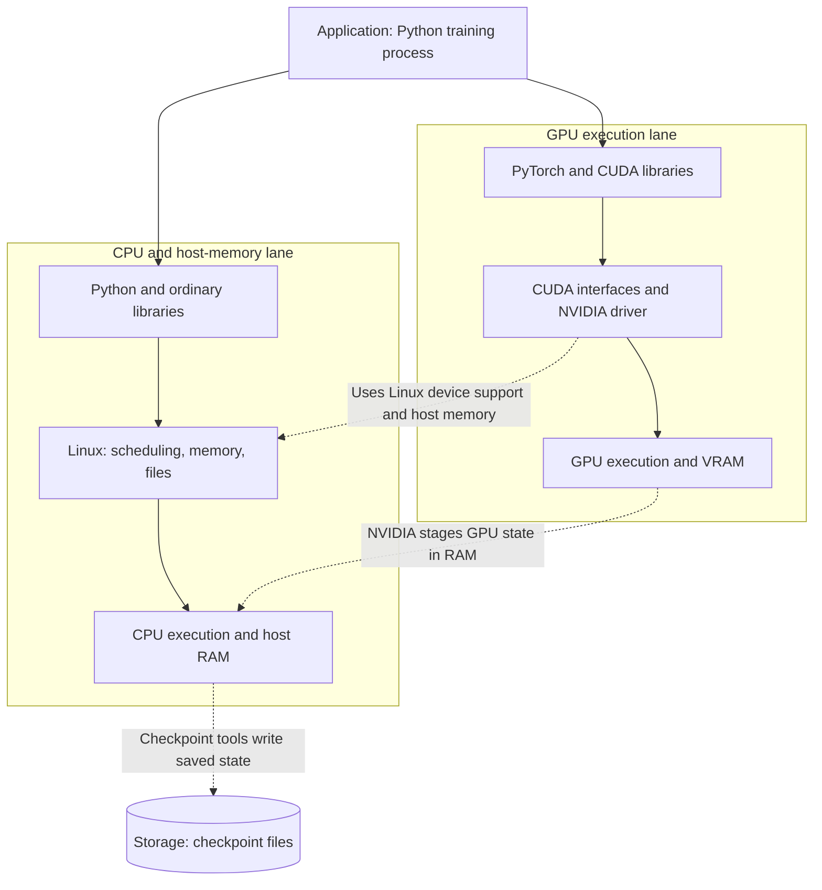

# Learning CPU and GPU checkpointing

A running program can become saved files and later become a running program again. This repository studies what must be saved to make that possible, how Linux and NVIDIA cooperate, and what an experiment can actually prove. The scope is a bounded learning POC: one Linux host, one process, and one NVIDIA GPU.

Start here if you know basic programming but have not taken an operating-systems course. The chapters introduce the machine and OS concepts used by the experiments; the code explains non-obvious operations beside their use. The [teaching plan](docs/readability-plan.md) identifies the remaining explanations and their prerequisite order.

## Start with the machine

The **CPU** executes a program's general instructions: running Python, deciding which batch comes next, and asking for GPU calculations. **RAM**, also called host memory, holds the objects and working data that the CPU accesses. A **GPU** executes many numerical operations in parallel. Its device memory, commonly called **VRAM**, holds tensors and other data used by those calculations.

**Storage** holds files: program code, datasets, and saved checkpoints. RAM and VRAM are live working memory; their contents do not by themselves survive losing the machine. Storage can outlive a process, but a local disk does not necessarily survive removal of a cloud instance. A durable checkpoint needs both a completed write and storage that survives the failure it is meant to protect against.

A **program** is a set of instructions, such as a Python script on disk. A **process** is a running instance of that program, with current memory, execution positions, and resources. Two processes can run the same program while holding different data. Its **state** is the information needed to describe where it has reached and continue its work.

The **operating system**, Linux on our execution host, manages CPU scheduling, memory, files, and access to devices. Its central privileged component is the **kernel**. Applications request services through operating-system interfaces rather than managing all hardware themselves. A **library** supplies reusable code; PyTorch is one example. A **driver** is software that manages a device and exposes operations applications can use. NVIDIA's driver manages the GPU's memory and execution state.

These are cooperating paths, not a single ladder with a GPU beneath the CPU and a disk beneath the GPU. The application runs on the CPU and submits GPU work through libraries and the driver. Storage is the destination for saved state, not another execution layer.

## Why model weights are only part of the state

Imagine training has completed update 20. The model's learned numbers may be in VRAM, while Python's counter and the choice of the next input batch live in RAM. The optimizer also remembers information from earlier updates; a random-number generator affects later data and calculations. Linux tracks open files, and the CPU has an execution position. These pieces must agree about which work has completed.

An **application checkpoint** saves values chosen by the program, for example model weights, optimizer state, random-generator state, and data position. A fresh program loads them and reconstructs training. A weights-only save is usually insufficient for equivalent training continuation.

A **process checkpoint**, or transparent snapshot, instead aims to reconstruct the running process and its supported resources. It must preserve memory and the execution context as well as GPU state. “Transparent” describes the restore mechanism; our experiments can still use an explicit waiting point to make the saved boundary observable. Neither approach automatically rolls back external files, remote services, or the whole machine.

## Reading path

1. [CPU checkpointing](docs/01-cpu-checkpointing.md): memory, threads, files, CRIU's nine capture/restore stages, and how DMTCP differs.
2. [GPU checkpointing](docs/02-gpu-checkpointing.md): asynchronous CUDA work, NVIDIA's state transitions, CPU/GPU coordination, costs, limitations, and useful comparisons.

The Markdown chapters are the authoritative explanation. The CPU chapter also links to a standalone interactive walkthrough. After the concepts, read the [single-GPU fine-tuning research](research/single-gpu-finetuning.md), the [implementation plan](docs/implementation-plan.md), and [experiment results](experiments/results.md). The [runnable LoRA experiment](experiments/finetuning/README.md) explains setup, correctness checks, and timing commands.

The proposed [independent lifecycle plan](docs/independent-lifecycle-plan.md) separates trainer, capture, and restore entrypoints. It awaits approval before implementation on a new branch.

## What has been observed

September 14, 2026 evidence covers two different execution hosts:

- **EC2 A10G, driver 570.172.08: isolated four-update LoRA continuation passed.** Application restart and CRIU restore match uninterrupted training with dropout zero and 0.1. CRIU trials verify original-process exit, job B, restored state, and continuation; two successive captures also pass. The observed diagnostic CRIU trials take about one minute, or under two minutes for two captures. Interrupted-system-call warnings and sharing ownership remain qualified.
- **Earlier L4 container, driver 595.58.03:** CRIU was blocked during startup feature detection. NVIDIA GPU-only suspension passed while the CPU process stayed alive. DMTCP restored a complete GPU process after original exit with matching tensor data and subsequent computation, but shared-memory warnings remain unresolved.

Three paired warm timing trials measured median capture-to-filesystem-sync and restore-to-next-update times of **1.30 s / 7.95 s** for application checkpoints and **32.20 s / 4.47 s** for CRIU. Saved files were **6.71 MB** versus **3.69–3.70 GB**. CRIU resumed faster in this configuration, while saving required substantially more time and storage.

The [measured results](experiments/results.md#four-update-lora-acceptance-and-timing--2026-09-14) contain dated evidence and exact qualifications. These are same-host experiments; replacement-host, spot recovery, and inference cold-start comparisons remain untested. This repository is not building a production scheduling platform.

On September 17, the readability refactor passed 14 CPU checks and nine fresh GPU validation cases, including active dropout and repeated CRIU capture. The [validation record](experiments/results.md#readability-refactor-validation--2026-09-17) covers the dedicated pipeline files and cleanup fix. The [teaching plan](docs/readability-plan.md) separates the implemented comments and code walkthrough from the deeper OS chapter work still planned.
