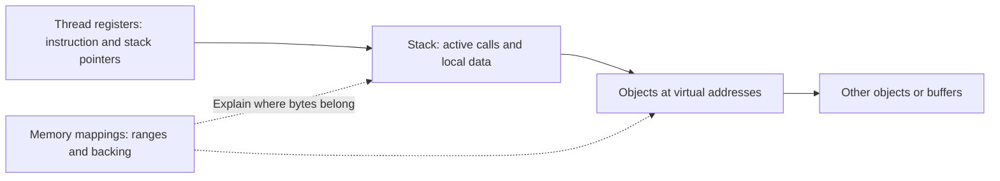
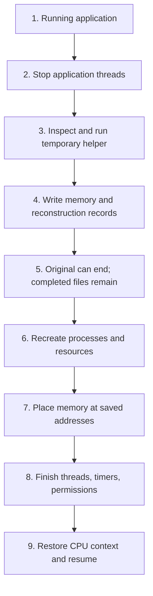

# 1. CPU checkpointing: reconstructing a running process

[Foundations](../README.md) · [Next: GPU checkpointing](02-gpu-checkpointing.md)

A process snapshot contains memory bytes and records explaining how to reconstruct a running program. “CPU checkpoint” here means the state of selected processes, not a copy of the entire CPU chip or every application on the machine. We first study a CPU-only program because its moving parts remain necessary when a GPU is added.

## A process is more than its variables

A process has one or more **threads**. Each thread is a sequence of instructions that Linux schedules on a CPU core. Threads in a process share its ordinary address space, but each needs its own execution position and stack. Pausing just one thread is insufficient if another can still change the data being copied.

Consider a program reading fixed-size records from a file. It has reached `step = 20`, holds a random token in memory, and has an open file positioned just before record 21. To resume correctly it needs the counter and token, the file position, and the instruction that continues the loop. Starting the script again normally recreates initial state; it does not automatically recover those details.

RAM holds this live state. A file on disk holds bytes that persist independently of the process. A checkpoint tool turns selected live state into files, then later reconstructs live state from them. Those files are passive: they do not keep executing the loop while the process is absent.

### Addresses, pointers, stacks, and registers

A process sees numbered **virtual addresses**. Linux maps ranges of these addresses to memory or files. A **memory mapping** describes such a range, including its permissions and backing. Virtual addresses are not fixed physical locations in RAM: Linux can back them with different physical memory while preserving the addresses the program sees.

A **pointer** is a value referring to an address. Suppose one object contains the address of another. Restoring the target object's bytes at an unrelated address leaves the saved pointer pointing somewhere else. Reconstructing the expected address layout is therefore part of restoring memory, not an optional detail.

A thread's **stack** holds active function calls and associated local data. Its **CPU registers** are small values used directly during execution, including the stack pointer and instruction pointer. The stack pointer locates the active stack; the instruction pointer identifies where execution continues. Saving stack bytes without the registers does not tell Linux how to resume that thread.



### State held by Linux

An application uses a **file descriptor**, a small integer, to refer to an open file or another resource. Linux maintains the underlying resource and relationships, including file positions. Processes may also use pipes for communication, sockets for local or remote connections, timers, and permissions associated with a user identity. Memory bytes alone do not describe all these resources.

A snapshot must capture supported resource descriptions and recreate their relationships. Reopening a file reference does not mean the checkpoint contains that file's full contents. Executables, libraries, input files, and external services may need to remain available separately. CRIU documents these boundaries as [external resources](https://criu.org/External_resources).

## Follow a process through CRIU's nine stages

**CRIU** means Checkpoint/Restore In Userspace. It is Linux tooling that inspects a process, saves its supported state, and uses Linux interfaces to reconstruct it. The following is a simplified CPU-only sequence, with the reason for each stage beside its mechanism. The [interactive nine-step walkthrough](assets/criu-walkthrough.html) presents the same process with Previous, Next, Play slowly, and Restart controls. Download/open the HTML locally or serve it as a static file; GitHub's source viewer does not run its JavaScript.



### 1. The application is running

Instructions change memory, and reads advance file positions. Linux schedules threads on CPU cores and owns resource descriptions. CRIU can inspect process information through **`/proc`**, Linux's virtual filesystem exposing process and kernel information. This is an inspection interface, not the eventual checkpoint directory. See [Linux's `/proc` documentation](https://man7.org/linux/man-pages/man5/proc.5.html).

### 2. Stop the application threads

CRIU identifies the selected process tree and its threads, then stops ordinary application execution. A process tree is the parent/child relationship among processes; related processes can share resources that require coordinated capture. Other programs on the machine can continue running.

The reason is consistency: copying half a structure before an update and half afterward could save a state the application never actually had. **`ptrace`** is a Linux interface for controlling and inspecting another process; CRIU uses it while collecting and stopping the target. See [CRIU's process-tree collection](https://criu.org/Freezing_the_tree).

### 3. Inspect state and run a temporary helper

CRIU inspects information through `/proc` and `ptrace`. Some information is easier or only possible to gather from inside the target process. CRIU therefore injects a small helper known as **parasite code** into that process. It deliberately runs this temporary checkpoint machinery while ordinary application work remains controlled.

`ptrace` sets up the helper. Shared memory and a Unix socket—a local communication channel—allow commands and data to pass between CRIU and the helper. This is not a restart of the script or a new training iteration. See [CRIU's helper explanation](https://criu.org/Parasite_code).

### 4. Write memory and reconstruction records

CRIU writes memory bytes together with descriptions of their layout, threads, and resources. Bytes alone would not say where to place them or which instruction should run next. These descriptions supply the missing structure.

An **image** is a saved state file, not a picture. Common CRIU records include:

| Image | What it contributes |
| --- | --- |
| `pages-*.img` | Captured memory bytes, including objects and stacks |
| `mm-*.img`, `pagemap-*.img` | Memory layout and the placement of saved pages |
| `core-*.img` | Thread information and CPU registers |
| Process-tree and file-descriptor images | Process relationships and references to resources |

**CRIT** decodes structured CRIU image records for inspection. Raw page files are memory data, not structured records to decode in the same way. Names and contents vary with version and workload. See [CRIU image formats](https://criu.org/Images).

### 5. The original process can be gone

After a successful completed dump, our full-restore demonstration ends the original process. The snapshot remains as files; no saved application instructions are running. Other CRIU dump modes can leave the original running or stopped, so a successful command alone does not prove the original ended. See [CRIU's simple example](https://criu.org/Simple_loop).

Ending the original matters for the evidence: restoring after its exit demonstrates reconstruction, whereas pausing and unpausing the same process does not. The required files must survive independently. A completed image on local storage proves less about host-loss recovery than an image on storage known to survive instance removal.

### 6. Recreate processes and resources

CRIU reads the saved descriptions, rebuilds the process tree and shared resources, reopens supported files, and prepares memory. Linux interfaces such as **`fork`** and **`clone`** create processes or threads. The application has not yet resumed its ordinary instructions.

This does not run the training script from line one and call a model loader. Reconstruction code is building the surroundings that the saved instructions expect to find. See [CRIU's capture and restore sequence](https://criu.org/Checkpoint/Restore).

### 7. Put memory at its saved addresses

Saved private memory is initially loaded into temporary areas. A small **restorer** routine moves mappings into their required locations and rebuilds file-backed mappings. Linux's **`mmap`** creates memory mappings; **`mremap`** can move mappings.

Why not put every byte back immediately? The reconstruction code already occupies memory, possibly at addresses the saved application needs. Replacing that area could overwrite the very instructions doing the replacement. CRIU places the small restorer in a separate safe address range outside the conflicting layouts.

```text
Before final placement                   After final placement
Ordinary address ranges                  Same virtual address ranges
  Reconstruction code and data             Saved application objects and stacks

Separate safe address range              Separate safe address range
  Small restorer is executing here         Restorer survives the replacement
```

The saved pointers now identify the intended bytes again; the physical RAM locations need not match the original. See [memory dumping and restoring](https://criu.org/Memory_dumping_and_restoring) and [restorer context](https://criu.org/Restorer_context).

### 8. Complete remaining execution state

Remaining threads, timers, and credentials are completed late. Threads need their stacks and other memory ready. Timers should not expire during setup. **Credentials** describe user identity and permissions; dropping needed privileges before reconstruction is finished could prevent it from completing.

The order follows these dependencies, not an arbitrary reversal of every capture operation. CRIU's [restorer context](https://criu.org/Restorer_context) explains why these jobs belong near the end.

### 9. Hand control back to the saved application

The saved CPU register values are installed, including the stack address and next instruction address. Linux's **`rt_sigreturn`** mechanism restores an execution context so control can return to the application. See the [Linux signal-return interface](https://man7.org/linux/man-pages/man2/sigreturn.2.html).

Restoration begins during reconstruction; **resumption** is this final handoff. Doing it earlier could let application code access incomplete memory, files, or threads. For a GPU application, CUDA restoration must also be coordinated before ordinary GPU work can proceed. The next chapter distinguishes CRIU and DMTCP coordination; CPU threads need not remain stopped through every tool's GPU restore phase.

## What a small experiment can prove

Our CPU example reads 25 fixed-size records. Its checkpoint boundary is after record 20, with byte offset 100 and a random token held in memory. After restoration, those values should match before any more work occurs; the next record should be 21 and the final offset 125. An explicit readiness/release handshake keeps the program at the boundary. A short sleep is insufficient because it may expire before capture.

The evidence must also show the original process exited and the checkpoint/restore commands succeeded. CRIU can restore the same numeric process ID, so disappearance before restore is more useful than demanding a different ID afterward. Matching application logs alone cannot establish that CRIU actually ran. The current commands and lifecycle checks live in [experiment results](../experiments/results.md).

Even a passing counter cannot prove every Linux resource or every future workload is supported. It establishes continuity for the tested memory, file position, and lifecycle under that environment.

## Permissions and external boundaries

CRIU requires suitable Linux features and permission to inspect and reconstruct the target. Root inside a container can still lack kernel capabilities or be restricted by the surrounding host. A container is an isolated execution environment, not a guarantee of unrestricted operating-system access. Finding an executable proves it is installed; `criu check` probes capabilities; a real restore tests the intended operation. See [CRIU kernel checks](https://criu.org/Check_the_kernel).

On the earlier restricted L4 container, CRIU's initial CPU path failed during startup feature detection involving `kerndat_has_nftables_concat`. This does not mean the counter needs networking. Enabled user-namespace settings likewise did not make actual namespace creation succeed. On the later EC2 host, namespace probes and CPU/GPU restoration passed. Keep these distinct execution environments in [the evidence](../experiments/results.md#ec2-criu-validation--2026-09-14), separate from the mechanism above; restrictions in the tool sandbox also do not establish host permissions.

External changes also matter. A remote peer may time out while the process is absent. A file may have changed since capture. Restoring a process does not undo such changes, restore an entire filesystem, or rewind every other application.

## CRIU and DMTCP are different routes

**DMTCP**, Distributed MultiThreaded CheckPointing, is another process checkpoint system. The tested DMTCP route launches the application under its checkpoint machinery and uses its coordinator and plugins. It should not be described as CRIU's `/proc`/`ptrace`/parasite sequence with a different command name. Different mechanisms can encounter different permission and resource constraints.

DMTCP v4.2.0 introduced a native NVIDIA CUDA plugin, and our pinned maintenance revision includes later CUDA/PyTorch fixes. It is therefore inaccurate to present old CRAC work or a CRIU permission change as the only GPU process-checkpoint routes. See [DMTCP v4.2.0](https://github.com/dmtcp/dmtcp/releases/tag/v4.2.0), the [pinned source](https://github.com/dmtcp/dmtcp/tree/b175bb5ccadd2f02d11cf052f586d2d9ac62ad53), and our [research](../research/single-gpu-finetuning.md).

On the earlier L4 container, DMTCP's CPU counter restore passed. A complete PyTorch GPU process also restored after the original exited, but unresolved shared-memory warnings qualify that observation. The implemented EC2 LoRA experiment uses CRIU with its CUDA plugin; DMTCP was not benchmarked on EC2. A basic success under one mechanism does not establish unrestricted compatibility under either tool. Continue with [GPU checkpointing](02-gpu-checkpointing.md) to see what must be added to the CPU state.
