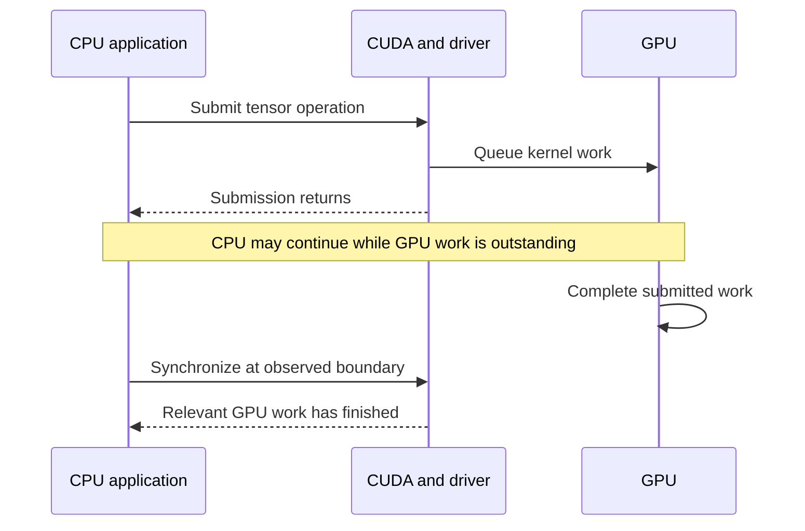
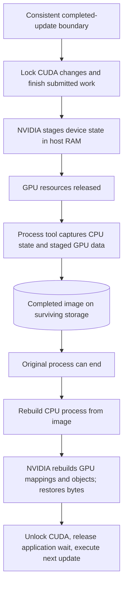

# 2. GPU checkpointing: keeping the CPU and GPU consistent

[Foundations](../README.md) · [Previous: CPU checkpointing](01-cpu-checkpointing.md)

The CPU chapter explains how saved memory, resources, and execution positions become a running process again. A GPU program has another state owner: the device driver. Ordinary Linux memory contains references to GPU resources, but those references do not contain everything needed to reconstruct the resources themselves. NVIDIA's checkpoint support supplies that missing capability.

## How a CPU program gets work onto a GPU

Python runs on the CPU. A tensor operation in PyTorch can call CUDA libraries, which ask NVIDIA's driver to allocate device memory or submit computation. A **GPU kernel** is a function executed on the GPU; this use of “kernel” is different from the Linux operating-system kernel. One training update can launch many GPU kernels.

**CUDA** is NVIDIA's software platform and interfaces for GPU computation. An **API** is a set of callable functions. The CUDA Runtime and Driver APIs are two ways software controls the same GPU environment, not separate devices.

| Component | Role |
| --- | --- |
| Python, PyTorch, and numerical libraries | Express tensor operations and turn them into computation, sometimes through libraries such as cuBLAS |
| CUDA Runtime API | Provides functions such as `cudaMalloc`, handling more setup implicitly |
| CUDA Driver API | Provides lower-level control, including explicit contexts/modules and checkpoint interfaces |
| NVIDIA driver | Manages GPU access, memory, execution, and the checkpoint/restore capability |
| `cuda-checkpoint` | Command-line control for NVIDIA's driver capability |
| CRIU CUDA plugin or DMTCP CUDA plugin | Coordinates that capability with its respective process checkpoint mechanism |

The Runtime and Driver APIs can coexist in one application. See NVIDIA's [Runtime versus Driver APIs](https://docs.nvidia.com/cuda/cuda-runtime-api/driver-vs-runtime-api.html).

An **allocation** is a reserved region of device memory. A **context** is the process's GPU environment, including resources associated with its use of the device. A **stream** is an ordered sequence of GPU operations; an **event** is a marker used to track or coordinate progress. Tensor bytes, their virtual addresses, and the surrounding CUDA objects all matter to restoration.

### Submission is not completion

GPU work is often **asynchronous**: the CPU submits operations and can continue before the GPU finishes them. A Python line returning does not by itself mean every GPU calculation it requested has completed.



A snapshot needs a consistent relationship between CPU and GPU state. A CPU counter saying “update 20 completed” beside model tensors from update 19 would be wrong. Preventing new changes and waiting for outstanding work makes capture meaningful. NVIDIA's mechanism finishes submitted work; it does not save a kernel halfway through an instruction. See [NVIDIA's checkpoint sequence](https://developer.nvidia.com/blog/checkpointing-cuda-applications-with-criu/).

## What continuing training requires

The weights are enough to represent the learned model for inference, or to start another training run. Equivalent continuation additionally depends on the optimizer, next input, random generators, and other stateful parts of training.

For a simplified momentum optimizer, let `v_next = μ × v + g` and `w_next = w − η × v_next`. Here `w` is a weight, `g` its next gradient, `v` accumulated momentum, `μ` the momentum coefficient, and `η` the learning rate. Start both runs with `w20 = 10`, next gradient `g21 = 2`, `μ = 0.9`, and `η = 0.1`:

| Restored state | Next momentum | Next weight |
| --- | --- | --- |
| Correct momentum `v20 = 4` | `0.9 × 4 + 2 = 5.6` | `10 − 0.1 × 5.6 = 9.44` |
| Weights only, momentum reset to zero | `0.9 × 0 + 2 = 2` | `10 − 0.1 × 2 = 9.80` |

The starting weights matched, yet the next update differed. Adam similarly carries running histories of gradients and squared gradients, as well as step-dependent behavior. Which optimizer tensors exist depends on the implementation and configuration.

| State | Why it affects continuation |
| --- | --- |
| Model weights | Define the current learned model |
| Optimizer history | Changes how the next gradient becomes an update |
| Learning-rate schedule and step | Determine the next update's scale and position in training |
| Data or sampler position | Prevent skipping or repeating input batches |
| Random-generator states | Affect shuffling, dropout, and other random choices |
| Mixed-precision scaling state, when used | Preserves the training configuration for handling small gradients |
| Process and CUDA state | Supply live objects, execution positions, allocations, and resource relationships |

A complete application checkpoint can deliberately serialize the relevant training values and load them into a new process. A process snapshot instead reconstructs the existing process and supported CUDA environment. For our comparison, both should start from the same completed-update boundary and use the same storage-completion criterion.

A useful observable boundary is: complete update 20, synchronize GPU work, record state, announce readiness, and wait for explicit release. This is an experimental choice that prevents update 21 from racing capture. It does not mean transparent checkpointing requires a weights serialization routine or that arbitrary mid-kernel execution has been captured.

## Follow the GPU state into a full process image

NVIDIA exposes four Driver API operations:

| Operation | Successful state transition | Meaning |
| --- | --- | --- |
| `cuCheckpointProcessLock` | `RUNNING → LOCKED` | Prevent CUDA changes that conflict with checkpointing |
| `cuCheckpointProcessCheckpoint` | `LOCKED → CHECKPOINTED` | Complete checkpoint work, stage device state in host memory, and release GPU resources |
| `cuCheckpointProcessRestore` | `CHECKPOINTED → LOCKED` | Rebuild GPU resources and put saved data back |
| `cuCheckpointProcessUnlock` | `LOCKED → RUNNING` | Allow blocked CUDA activity to continue |

These are successful transitions, not a promise that every call or workload succeeds. The name **`CHECKPOINTED` means GPU state has been staged**, not that durable process image files exist. The [Driver API contract](https://docs.nvidia.com/cuda/cuda-driver-api/group__CUDA__CHECKPOINT.html) defines the operations and constraints.

### 1. Lock changes and finish submitted GPU work

Capture must prevent conflicting new CUDA operations and allow outstanding GPU work to finish. Otherwise tensor contents could change while they are being copied. Long-running work can therefore consume much of an interruption warning window before bytes are ready to save.

NVIDIA suspension alone does not stop every CPU thread. CPU code can continue or block when it calls locked CUDA operations. CPU process capture must coordinate those threads as well; locking CUDA is not the same as freezing all application state.

### 2. Stage GPU state in host RAM and release device resources

NVIDIA copies device memory into driver-managed host memory and preserves the information needed to reconstruct its CUDA resources. The GPU allocations can then be released for other work. The staged copy is still live process memory and can disappear with the process or host.

This is why a GPU-only pause/resume is useful but insufficient as a restart demonstration. It can show GPU release, matching restored tensors, and reuse by another job while the original CPU process remains alive. It cannot show restart from files after that process ends.

### 3. Capture the CPU process and staged GPU data

The process checkpoint system saves the CPU-side memory and supported resources, including the GPU data staged in host memory. CRIU uses the Linux reconstruction machinery explained in the previous chapter; DMTCP uses its own checkpoint machinery and plugin integration.



The diagram gives logical dependencies. The exact thread stopping and helper execution are tool-specific; the CRIU plugin does more than run an unrelated shell command after freezing everything.

### 4. Rebuild both sides before resuming

The process tool reconstructs host memory and resources. NVIDIA recreates the GPU mappings and CUDA objects, transfers data back, and preserves GPU virtual addresses so saved pointers continue referring to the intended allocations. Physical memory locations need not match the originals.

After GPU restoration, CUDA is unlocked and ordinary GPU work can continue. The diagnostic LoRA comparison verifies the restored state before allowing the next update. The historical DMTCP tensor probe releases its file wait earlier; its next CUDA call waits for the plugin to finish GPU restoration. Neither process-restore path uses `torch.load` to reconstruct training state from an application checkpoint. See [NVIDIA's restore description](https://github.com/NVIDIA/cuda-checkpoint#the-utility).

## The subtle part: CPU-tool coordination

A fully stopped process cannot execute NVIDIA's helper work. In the inspected CRIU CUDA plugin, CRIU obtains the CUDA restore-thread ID, temporarily resumes that helper thread for device checkpoint/restore, then stops it again as needed. Ordinary application execution remains coordinated around those operations.

The relevant functions include `cuda_plugin_pause_devices()`, `cuda_plugin_checkpoint_devices()`, `resume_restore_thread()`, and `cuda_plugin_resume_devices_late()`. The last hook restores and unlocks CUDA. If the plugin owns restoration, appending unconditional manual restore/unlock commands can fail because CUDA is already running. A manual route must instead have automatic handling disabled and verified. See the [CRIU CUDA plugin source](https://github.com/checkpoint-restore/criu/blob/criu-dev/plugins/cuda/cuda_plugin.c).

The inspected source disables CUDA handling for CRIU **pre-dump**, a preliminary capture mechanism. CPU support for preliminary memory copies does not establish incremental GPU capture. We can inspect this coordination and NVIDIA's public contract; we cannot infer the byte layout of every private driver record.

**CRIUgpu** is the name used in research describing GPU-aware CRIU integration. For this NVIDIA experiment, identify the actual CRIU CUDA plugin and `cuda-checkpoint` versions. This vendor-supported route differs from approaches that record and replay every CUDA call. See the [CRIUgpu paper, v1](https://arxiv.org/html/2502.16631v1) and [CRIU GPU integration](https://criu.org/GPU_Checkpointing).

DMTCP's native NVIDIA plugin is another route, not evidence that CRIU's permissions or helper sequence have changed. In the pinned plugin, GPU capture happens before application threads are stopped. During restart, CUDA restoration is coordinated through `DMTCP_EVENT_RUNNING_AFTER`, after CPU threads can run again. NVIDIA's helper needs those threads available for communication; keeping them all stopped could prevent restoration from finishing. CPU execution being possible therefore does not mean ordinary GPU work is ready yet. See the [pinned DMTCP CUDA plugin](https://github.com/dmtcp/dmtcp/blob/b175bb5ccadd2f02d11cf052f586d2d9ac62ad53/plugin/cuda/cuda-ckpt.cpp).

The measured native DMTCP restoration is qualified by anonymous shared-memory warnings: capturing `/dev/zero (deleted)` contents as private memory can lose sharing relationships. A separate `anon_inode` warning concerns unavailable kernel objects. Matching tensor data does not make those warnings harmless. Our [research](../research/single-gpu-finetuning.md) and [results](../experiments/results.md) retain the precise version pins and unresolved constraints.

## Follow the bytes and the time

A GPU process snapshot may include fixed base-model weights, cached allocations, and other live memory that an application checkpoint would omit. This difference is particularly relevant for **LoRA**, where only small adapter parameters are trained: the application can save adapters and their optimizer state while a process image preserves the live process containing the much larger base model.

### A training-state size example

For an illustrative one-billion-parameter model, a 16-bit value takes 2 bytes and a 32-bit value takes 4 bytes. Using decimal GB:

| Assumed component | Calculation | Size |
| --- | --- | --- |
| 16-bit model weights | `1 billion × 2 bytes` | 2 GB |
| One 32-bit momentum value per parameter | `1 billion × 4 bytes` | 4 GB |
| Adam's two histories, if both are 32-bit | `1 billion × 2 × 4 bytes` | 8 GB |
| Optional 32-bit master weights | `1 billion × 4 bytes` | 4 GB |

These are alternative configuration ingredients, not components to add blindly. The assumed weights plus momentum total 6 GB; weights plus two 32-bit Adam histories total 10 GB, or 14 GB with separate master weights. Actual optimizer precision and implementation determine the total. These figures describe selected training values, not total training VRAM or measured process-image size; activations, gradients, buffers, and other memory can matter. Small counters do not explain the bulk of a large checkpoint.

### A transfer example

Assume an uncompressed snapshot has `G = 16 GB` of GPU data and `H = 4 GB` of CPU data to capture. Let the effective GPU-to-RAM transfer rate be `12 GB/s`, and completed storage writes run at `1 GB/s`.

- GPU staging takes approximately `16 / 12 = 1.33 seconds`.
- Writing approximately `H + G = 20 GB` takes `20 seconds`.
- A sequential copy-and-write estimate is **21.33 seconds**, plus draining, metadata, and other overhead.

These are illustrative assumptions, not measurements or a throughput promise. Image size need not equal a simple RAM-plus-VRAM reading: shared pages, file backing, cached allocations, and encoding affect it. Host RAM must accommodate its existing workload plus roughly the staged GPU data and additional headroom for the checkpoint machinery and buffering. A container's RAM limit can be smaller than the host-wide free-memory report.

There are **two clocks**. Request-to-GPU-release tells us when another job might use the GPU. Request-to-completed-image-on-surviving-storage tells us when losing the original host is safe. The second may finish later. A buffered write returning is not by itself evidence of durable storage.

### Why saving every update can dominate training

Suppose a training update takes 1 second and a blocking completed save takes 20 seconds:

| Save schedule | Save time relative to useful training, `C/T` | Save share of elapsed train-plus-save time, `C/(T+C)` |
| --- | --- | --- |
| Every update | 2000% | About 95.2% |
| Every 100 updates | 20% | About 16.7% |
| Every 1,000 updates | 2% | About 2.0% |

Longer intervals reduce write overhead while increasing work at risk. “20% overhead” in the middle row means time added relative to useful training, not 20% of total elapsed time. For abrupt loss after a completed save, the number of completed unsaved updates can range from zero to nearly the interval length. Warnings, long save periods, and failures during writes affect the actual loss distribution.

Keeping only a `latest` directory limits retained storage, but writing a new full image still transfers its full bytes. Write a new candidate, establish completion, and then mark it as the latest usable checkpoint while retaining the prior good image until replacement is safe. This protects recovery from incomplete writes; it is not incremental capture. Saving less often, selecting fewer values, verified change-only capture, or verified overlap with training are different mechanisms with their own constraints.

## Checkpoint economics: keep three times separate

| Symbol | Meaning |
| --- | --- |
| `T` | Useful training time between periodic checkpoints |
| `C` | Time to capture and finish storing a checkpoint |
| `W` | Warning lead time before resources disappear |
| `p` | Whole-job compute price per minute: GPU count × per-GPU hourly rate / 60 |

If interruptions are approximately uniform within the useful-training interval, saves are short enough to ignore in that approximation, and resumed training has the same speed, expected repeated training is approximately **`T/2`**. This is training since the last completed save, not half the time it takes to write a save. If saving every `N` iterations of duration `s`, `T = N × s`.

Historical large-training examples show why this distinction matters:

| Published example | Reported training between saves | Calculated `T/2` | Ratio to an illustrative 2-minute warning |
| --- | --- | --- | --- |
| [Databricks/PyTorch, 2024](https://pytorch.org/blog/training-moes/) | Cloud checkpoint cadence as frequent as about 30 minutes | About 15 minutes | 7.5× |
| [BLOOM 176B, March 22, 2022](https://github.com/bigscience-workshop/bigscience/blob/master/train/tr11-176B-ml/chronicles.md#2022-03-22) | 100 iterations, about 3 hours | About 90 minutes | 45× |

These averages and ratios are calculated scenarios, not measured average recovery losses. BLOOM separately reported around **40 seconds to write a checkpoint** in its [March 18 timing record](https://github.com/bigscience-workshop/bigscience/blob/master/train/tr11-176B-ml/chronicles.md#2022-03-18). The potential repeated training comes from hours between saves, not half of that 40-second write.

The two-minute comparison comes from [AWS's best-effort Spot stop/terminate warning](https://docs.aws.amazon.com/AWSEC2/latest/UserGuide/spot-instance-termination-notices.html). The workloads above were not presented as AWS Spot experiments, and warning behavior must be verified for the selected service. When the whole instance will disappear, a successful warning-triggered save needs:

```text
detection time + time to reach the chosen boundary + C + safety margin ≤ W
```

A complete **application checkpoint can also be triggered by the warning**. If it finishes in time, it can preserve the latest completed update too. Avoiding `T/2` rollback is then not unique to a process snapshot; the comparison turns on application support and measured total save/restart cost.

### Illustrative compute-cost example

Assume a spot compute price of **$2.00 per GPU-hour**. This is an illustrative input, not a provider quote; substitute the actual rate for a real workload. Use the spot price when valuing repeated spot compute.

Assume `T = 30 minutes`, a successful warning save, and an additional **billed** save duration of 0.5 minutes. Compared with falling back to the prior periodic checkpoint, the simplified net avoided compute cost is `(15 − 0.5) × p`:

| Job | Spot compute per hour | Whole-job `p` per minute | Simplified net saving per interruption |
| --- | --- | --- | --- |
| 1 GPU | $2.00 | About $0.0333 | About $0.48 |
| 8 GPUs | $16.00 | About $0.2667 | About $3.87 |

For eight GPUs, avoiding 15 minutes of repeated work saves $4.00, and the assumed 30-second save costs about $0.13. A hypothetical 20% share of the $3.87 net is about **$0.77 per successful interruption**. At `T = 3 hours`, the same assumptions yield about **$23.87** net and **$4.77** for a 20% share. These are arithmetic at the assumed per-GPU rate, not a quoted cluster offer or an established business model.

The calculations assume all GPUs would otherwise repeat the same lost work, equal restart times, unchanged speed and price after resume, and a save that succeeds. A 30-second eight-GPU save is an assumption. Missed warnings, failed saves, restore differences, storage, and transfer charges must enter a real comparison. Turning a fee per interruption into an hourly premium additionally needs interruption frequency. The learning POC remains one GPU.

### Who waits while a GPU is reclaimed?

A provider's **scheduler** assigns compute resources to jobs. If it reclaims job A's GPU to run job B, A still occupies that GPU while capture requires it. B can use it only after release and necessary cleanup/setup. Charging A during capture, waiving that time, charging a snapshot fee, or charging B while it waits are provider policy questions that must be checked for the selected service.

Keeping A's CPU process and staged state in RAM while B uses the GPU can support a planned handoff, if the environment permits it. It does not protect A against host loss. Counting both as simultaneously using the same exclusive GPU would overstate utilization; RAM/storage costs and B's delay also matter.

Storage surviving an ordinary pause or restart does not establish that it survives instance deletion. Verify whether the chosen volume or shared filesystem remains available after the failure being tested. Recovery depends on the lifecycle of the actual storage, not merely the word “disk.”

## Compatibility limits and useful applications

NVIDIA's documented functionality has version-specific limits, including UVM and specified CUDA IPC APIs. **UVM/managed memory** lets the CUDA system manage memory accessible across CPU and GPU; **IPC** means inter-process communication or sharing. Ordinary PyTorch cached device allocations are not automatically UVM. See [NVIDIA's functionality and limitations](https://github.com/NVIDIA/cuda-checkpoint#functionality) and [PyTorch memory management](https://docs.pytorch.org/docs/main/notes/cuda.html#memory-management).

This distinction matters for quantized fine-tuning: four-bit weights alone do not imply managed memory, but a paged bitsandbytes optimizer can allocate sufficiently large state using `cudaMallocManaged`. Start compatibility reasoning with the actual optimizer and initialized state, not a label such as QLoRA. The [fine-tuning research](../research/single-gpu-finetuning.md) preserves the code references and workload conditions.

Restoration also requires available RAM/VRAM, compatible libraries and driver behavior, and the necessary Linux permissions. The documented GPU remapping API requires the same chip type and sufficient memory; arbitrary L4-to-H100 migration is not our claim. Recheck installed versions after a host resume. A matching CUDA runtime version does not imply matching compiler headers are installed.

The initial scope excludes multi-GPU communication, NCCL, multi-process training, CUDA IPC, managed memory, MPS/MIG behavior, arbitrary cross-host migration, and production scheduling. These are separate compatibility or coordination questions, not things a one-tensor restore answers.

Potential uses include planned maintenance, suspending lower-priority work to run an urgent job, preserving applications without complete save logic, and reducing repeated initialization where measured restore costs justify it. Cross-host movement additionally needs compatibility and external-resource handling. Sudden host failure still needs a previously completed durable checkpoint; an on-warning mechanism cannot create one after the host is lost. See [NVIDIA's platform use cases](https://github.com/NVIDIA/cuda-checkpoint#background).

## What evidence connects the mechanism to training?

The implemented bounded comparison uses one training loop for uninterrupted references, a complete application save/restart, and a process snapshot/restore. After update 2, compare restored model and optimizer tensors, step, data position, and random-generator state **before** update 3. Then compare updates 3–4 against the reference. Confirm the runs also matched at update 2 before capture. The dropout-0.1 case additionally verifies active CUDA dropout in training mode and actual random-generator advancement; restored training behavior is inspected before any repair.

A **digest** is a short fingerprint calculated from bytes. Matching digests strongly support equality of the checked data; they do not prove every resource was restored. A mismatch does not measure numerical closeness. If later updates permit rounding differences, compare actual values under a tolerance chosen beforehand. A fixed seed alone does not guarantee identical GPU results; the operations and environment matter. See [PyTorch reproducibility guidance](https://docs.pytorch.org/docs/main/notes/randomness.html).

Record image completion, verified original-process exit, GPU availability observed after exit, and filesystem sync separately. An earlier disappearance from GPU monitoring may be temporary. A second small job must use the released GPU and exit before restoring the first. Measure restore-to-next-completed-update, image size, and peak host RAM using the same cached assets, pause boundary, and storage criterion for the application-checkpoint comparison. Detailed state inspection belongs in correctness runs, outside headline timing intervals.

The [four-update LoRA results](../experiments/results.md#four-update-lora-acceptance-and-timing--2026-09-14) pass on EC2 A10G with CRIU, including active dropout, application restart, and repeated restoration. Median capture/sync and restore/update times were 32.20 s and 4.47 s for CRIU, versus 1.30 s and 7.95 s for application checkpoints across three warm timing pairs. These measurements demonstrate same-host continuation with qualified compatibility; shared-memory ownership and interrupted-system-call warnings remain visible. Replacement-host recovery, real spot interruption, and inference cold-start comparisons remain untested. The earlier container's CRIU blocker and DMTCP tensor results are separate historical observations. See the [implementation plan](implementation-plan.md) and [fine-tuning research](../research/single-gpu-finetuning.md) for scope and rationale.
