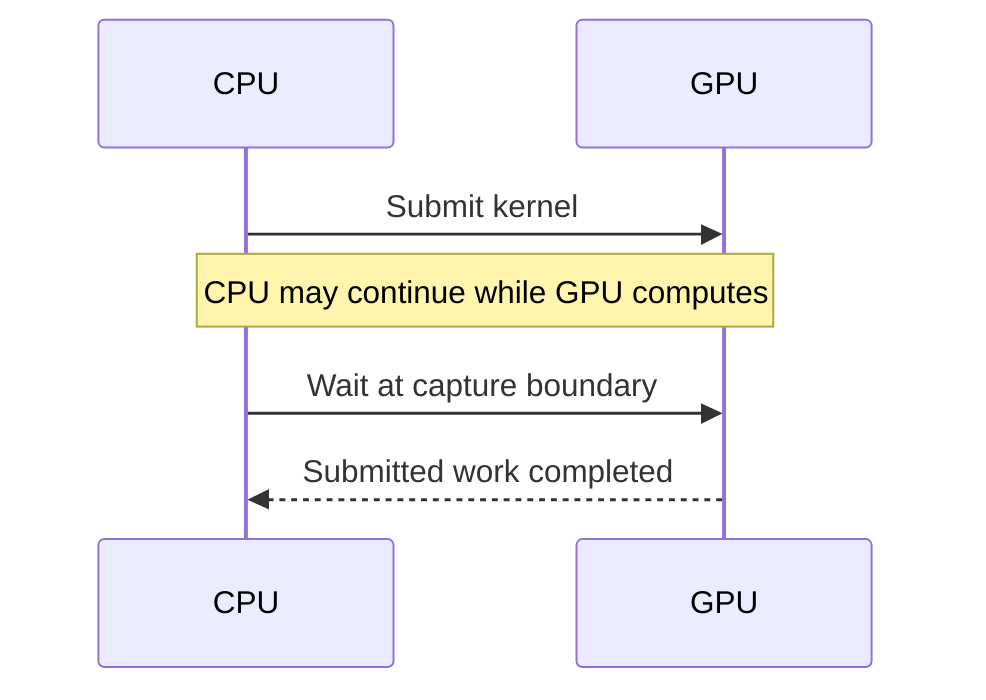
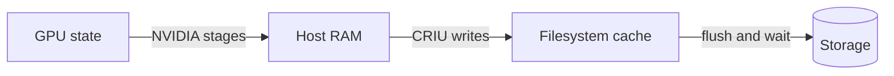

# 2. GPU checkpointing: keeping the CPU and GPU consistent

[Foundations](../README.md) · [Previous: CPU checkpointing](01-cpu-checkpointing.md)

A GPU process needs two kinds of restoration: Linux process state and the
resources managed by NVIDIA's driver. CPU memory can hold a pointer to a GPU
allocation without containing that allocation's bytes or the driver's state.

## How a CPU program gets work onto a GPU

Python runs on the CPU. PyTorch calls **CUDA**, NVIDIA's GPU programming platform,
to allocate device memory and launch **GPU kernels**: functions that execute on
the GPU, distinct from the Linux operating-system kernel.

| Layer | Role |
| --- | --- |
| PyTorch and numerical libraries | Turn tensor operations into computation |
| CUDA Runtime/Driver APIs | Callable interfaces for GPU resources and execution; the Driver API exposes checkpoint operations |
| NVIDIA driver and `cuda-checkpoint` | The driver provides GPU checkpointing; the command-line utility controls it |
| CRIU CUDA plugin | Coordinates NVIDIA's operations with CPU process capture/restore |

The [Runtime and Driver APIs](https://docs.nvidia.com/cuda/cuda-runtime-api/driver-vs-runtime-api.html)
can coexist. An **allocation** reserves device memory; a **context** holds a
process's GPU environment; a **stream** orders GPU operations; an **event** tracks
progress. These objects and their relationships matter alongside tensor bytes.

### Submission is not completion

GPU operations are often **asynchronous**: the CPU can continue after submitting
work, before the GPU finishes it.



Capture must prevent new changes and finish outstanding work. A CPU counter at
update 20 beside tensors from update 19 would be inconsistent. NVIDIA drains
submitted work; it does not save a running kernel halfway through an instruction.
See [NVIDIA's checkpoint sequence](https://developer.nvidia.com/blog/checkpointing-cuda-applications-with-criu/).

## What continuing training requires

Weights describe the learned model, but equivalent training continuation also
needs optimizer history, learning-rate schedule, input position, random-generator
state, and mixed-precision scaling state when used. Process snapshots additionally
preserve supported live objects and execution positions.

For a momentum optimizer, `v_next = 0.9 × v + g` and
`w_next = w − 0.1 × v_next`. With `w = 10` and next gradient `g = 2`:

| Saved state | Next momentum | Next weight |
| --- | --- | --- |
| Weights and momentum `v = 4` | 5.6 | 9.44 |
| Weights only, momentum reset to 0 | 2 | 9.80 |

Matching starting weights did not preserve the next update. Adam likewise needs
its gradient histories and step state.

A complete **application checkpoint** serializes training values for loading into
a new process. A **process snapshot** reconstructs the existing process. Our
comparison uses the same completed-update boundary and storage criterion for
both. The trainer synchronizes GPU work, announces readiness, and waits for
release so the next update cannot race capture. The exact
[state contract](implementation-plan.md) belongs to the experiment.

## Follow the GPU state into a full process image

NVIDIA's [Driver API](https://docs.nvidia.com/cuda/cuda-driver-api/group__CUDA__CHECKPOINT.html)
defines these successful transitions:

| Operation | Transition | Effect |
| --- | --- | --- |
| `cuCheckpointProcessLock` | `RUNNING → LOCKED` | Block conflicting CUDA changes |
| `cuCheckpointProcessCheckpoint` | `LOCKED → CHECKPOINTED` | Stage GPU state in host RAM and release GPU resources |
| `cuCheckpointProcessRestore` | `CHECKPOINTED → LOCKED` | Rebuild GPU resources and restore their data |
| `cuCheckpointProcessUnlock` | `LOCKED → RUNNING` | Allow blocked CUDA activity to continue |

**`CHECKPOINTED` means GPU state is staged in RAM. It does not mean a durable
process image exists.**

### 1. Lock changes and finish submitted GPU work

Outstanding work must finish before its data is copied. A long kernel can consume
much of a warning window. CUDA locking alone does not stop all CPU threads;
the process checkpoint tool must coordinate CPU changes too.

### 2. Stage GPU state in host RAM and release device resources

NVIDIA copies device memory into driver-managed host memory and preserves CUDA
reconstruction information. Released GPU resources can serve another job, but
the staged copy still depends on the original process and host remaining alive.
GPU-only pause/resume therefore does not establish restart from files.

### 3. Capture the CPU process and staged GPU data

CRIU saves supported CPU state, including staged GPU data, into image files.
Writes may initially land in Linux's **page cache**, RAM used to buffer file data.
The controller must separately finish storage writes before publishing success.



This diagram shows data movement, not the complete control sequence. The
[publication protocol](independent-lifecycle-details.md) orders file and directory
flushes and the completion record. A storage acknowledgement does not establish
survival of instance deletion; the chosen volume must survive that event too.

### 4. Rebuild both sides before resuming

CRIU reconstructs host memory and resources. NVIDIA recreates GPU objects and
virtual addresses, transfers data back, then unlocks CUDA. Preserved addresses
keep saved pointers valid; physical memory locations may differ. See
[NVIDIA's restore description](https://github.com/NVIDIA/cuda-checkpoint#the-utility).
Our diagnostic run inspects restored state before releasing the next update.
The process-restore path does not load an application checkpoint with `torch.load`.

## The subtle part: CPU-tool coordination

A fully stopped process cannot run NVIDIA's helper. The
[CRIU CUDA plugin](https://github.com/checkpoint-restore/criu/blob/9539417f3e3cfa4eb84c319cd71f4d52f1f08645/plugins/cuda/cuda_plugin.c)
temporarily resumes the CUDA helper thread while keeping application execution
coordinated. Its late restore hook restores and unlocks CUDA. **Use one owner:**
with plugin-managed restoration, do not append unconditional manual
restore/unlock commands. The plugin disables CUDA handling during **pre-dump**,
CRIU's preliminary capture mode; CPU pre-dump support does not imply incremental
GPU capture.

**CRIUgpu** names the research on GPU-aware CRIU integration. In this experiment, the
concrete components are CRIU's CUDA plugin and NVIDIA's `cuda-checkpoint`.
See the [paper](https://arxiv.org/html/2502.16631v1) and
[CRIU integration](https://criu.org/GPU_Checkpointing).

[DMTCP's pinned plugin](https://github.com/dmtcp/dmtcp/blob/b175bb5ccadd2f02d11cf052f586d2d9ac62ad53/plugin/cuda/cuda-ckpt.cpp)
uses different coordination: GPU capture precedes CPU-thread stopping, and GPU
restore occurs after CPU threads can run again. It also restores GPU resources
when the original resumes after capture. Early GPU disappearance can therefore
be temporary. Measure availability after verified original exit.

The earlier DMTCP restore's shared-memory warnings remain unresolved: saving
shared pages as private bytes may lose sharing relationships. A separate
`anon_inode` warning concerns kernel objects. Matching tensors alone cannot
settle either issue; see [recorded evidence](../experiments/results.md).

## Follow the bytes and the time

A process image may include fixed base weights and cached allocations that an
application checkpoint omits. This matters for **LoRA**, which trains small
adapter parameters while keeping the larger base model fixed.

### A training-state size example

For one billion parameters, 16-bit weights take 2 GB; two 32-bit Adam histories
would add 8 GB; optional 32-bit master weights add 4 GB. These are configuration
assumptions, not total training VRAM or measured image sizes. Gradients, buffers,
activations, file-backed memory, and allocator behavior affect the actual total.

### A transfer example

Illustratively, staging 16 GB at 12 GB/s takes 1.33 s. Writing that data plus
4 GB of CPU state at 1 GB/s takes 20 s: **21.33 s sequentially**, before draining
work and other overhead. Host RAM needs room for staging and buffering; check
container limits as well as host-wide free RAM.

Keep separate timestamps for image completion, original exit, GPU availability
observed after exit, and storage completion. A completed file, a matching hash,
or a buffered write returning does not substitute for the storage flush.

### Why saving every update can dominate training

If useful training between saves takes `T` seconds and each blocking save takes
`C`, added overhead is `C/T`; save time's share of total elapsed time is
`C/(T+C)`. A 20-second save after every 1-second update consumes about 95% of
elapsed time; after 100 such updates, about 17%.

Retaining only a `latest` snapshot limits stored copies, not bytes written per
capture. Complete a new candidate before replacing the prior usable snapshot.
This is safe replacement, not incremental capture.

## Checkpoint economics: keep three times separate

Let `T` be useful training between periodic saves, `C` the completed save time,
and `W` the warning lead time. With approximately uniform interruptions and
short saves, expected repeated training is about **`T/2`**, not `C/2`.
For example, [BLOOM's historical log](https://github.com/bigscience-workshop/bigscience/blob/master/train/tr11-176B-ml/chronicles.md#2022-03-22)
reported roughly three hours between saves, distinct from its roughly
[40-second write](https://github.com/bigscience-workshop/bigscience/blob/master/train/tr11-176B-ml/chronicles.md#2022-03-18).

A warning-triggered save must satisfy:

```text
detection + wait for capture boundary + C + safety margin ≤ W
```

[AWS Spot's stop/terminate notices](https://docs.aws.amazon.com/AWSEC2/latest/UserGuide/spot-instance-termination-notices.html)
provide a best-effort two-minute warning. A complete application checkpoint can
also respond to that warning. Avoiding rollback is therefore not unique to
process snapshots; compare measured save and restart costs.

### Illustrative compute-cost example

At an assumed $2/GPU-hour, avoiding 15 minutes of repeated work while adding
30 seconds of billed save time saves about **$0.48 per GPU per successful
interruption**. This assumes equal restart costs and training speed, successful
warnings/saves, and no storage or transfer charges. It is an illustration, not
a measured saving or provider quote.

### Who waits while a GPU is reclaimed?

A **scheduler** assigns resources to jobs. Job B can use job A's GPU only after
release and required cleanup/setup. Keeping A's state in host RAM can support
that handoff, but not host-loss recovery. Charging for capture or waiting is a
provider policy question; storage survival must be checked separately.

## Compatibility limits and useful applications

[NVIDIA's limits](https://github.com/NVIDIA/cuda-checkpoint#functionality) include
version-specific restrictions on **UVM/managed memory** (CUDA-managed memory
accessible across CPU/GPU) and specified **IPC** (inter-process sharing) APIs.
[PyTorch caching](https://docs.pytorch.org/docs/main/notes/cuda.html#memory-management)
does not automatically use managed memory. Four-bit weights alone do not imply
UVM either, but paged optimizers can introduce it. Check the actual initialized
optimizer; see [QLoRA research](../research/single-gpu-finetuning.md).

Restore also needs sufficient RAM/VRAM, compatible software and driver behavior,
Linux permissions, and external files. NVIDIA's documented GPU remapping requires
the same chip type and sufficient memory; arbitrary GPU migration is not implied.
Recheck versions after instance resume.

This experiment excludes multi-GPU communication, multi-process training, CUDA IPC,
managed memory, GPU sharing/partitioning modes (MPS/MIG), and arbitrary cross-host migration. Potential
uses include maintenance, temporary GPU handoff, and avoiding repeated
initialization where restore is cheaper. Sudden host loss still requires an
already durable checkpoint. See [NVIDIA's use cases](https://github.com/NVIDIA/cuda-checkpoint#background).

## What evidence connects the mechanism to training?

Our four-update comparison checks model/optimizer tensors, schedule, input
position, random state, and effective training settings at update 2, before and
after restoration. Updates 3–4 must match uninterrupted references. The dropout
case verifies active training-mode dropout and CUDA random-state advancement;
it inspects restored settings before any repair.

A **digest** fingerprints bytes: matching digests strongly support equality of
the checked data, not correctness of every resource. Fixed seeds alone do not
guarantee deterministic GPU operations; see [PyTorch reproducibility](https://docs.pytorch.org/docs/main/notes/randomness.html).

The controller verifies original exit, runs a second GPU job, then restores.
Detailed inspection stays outside headline timing runs. The
[results](../experiments/results-detail.md#four-update-lora-acceptance-and-timing--2026-09-14)
report same-host continuation and timings with warnings qualified. Replacement
hosts, real Spot interruptions, and inference cold-start recovery remain untested.
