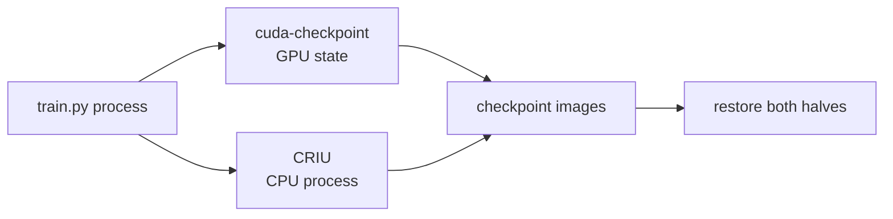

# Concepts and code map

This document is the bridge between the idea and the small POC. Read it before reading the implementation.

[Open the visual guide](r-2026-09-12T19-34-51.html) — diagrams, the proposed experiment, and the current project status.

## 1. What is being saved?

A running training job has state in two places:

1. **CPU process state**: Python code, CPU memory, threads, and open files.
2. **GPU state**: model tensors, optimizer tensors, CUDA context, memory mappings, and queued GPU work.

Saving only a PyTorch dictionary is an **application checkpoint**. It saves values chosen by the application and requires the program to reload them. Our POC is about the harder **transparent checkpoint**: save the running process together with the GPU state, without adding checkpoint logic to the training loop.

## 2. Why two tools are needed

Linux can save the CPU half, but it cannot inspect the private state managed by the NVIDIA driver. NVIDIA's `cuda-checkpoint` support handles the GPU half; CRIU handles the ordinary Linux process.

The implementation should keep this split visible: `train.py` owns training, while `checkpoint.sh` invokes the platform tools.

## 3. The checkpoint sequence

### 3.1 Reach a safe point

GPU work may still be running after the CPU launches it. The driver must prevent new CUDA changes and wait for submitted work to finish. We therefore checkpoint between short training steps, not inside a kernel.

**Code reference:** `train.py` will call `report_state(step, ...)` after each step. The shell script will use that known boundary as the pause point.

### 3.2 Suspend the GPU side

`cuda-checkpoint` locks CUDA calls, drains in flight work, copies device state into host memory, and releases the process's GPU resources. CPU threads are not the main subject of this operation; they may block when they call CUDA until the process is restored.

**Code reference:** `checkpoint.sh` will contain the lock/checkpoint/restore/unlock commands. Keep the commands explicit instead of hiding them in a Python wrapper.

### 3.3 Save the CPU side

CRIU freezes the process tree and writes the CPU memory and operating-system resources into image files. This is why a CUDA checkpoint alone is not enough to restart a Python process after it exits.

**Code reference:** `checkpoint.sh` will have one clearly named CRIU dump section and one restore section. The image directory should be a variable near the top of the script.

### 3.4 Restore and continue

Restore reverses the order: CRIU rebuilds the process, NVIDIA restores GPU allocations and CUDA objects, then CUDA calls are unlocked. The existing process can continue from the saved point.

**Code reference:** `train.py` should print a state report immediately after resume, then run five more steps. This makes “continued” visible in the terminal output.

## 4. What the training program should contain

Keep `train.py` to four understandable pieces:

1. `make_model()` creates a small two layer model on CUDA.
2. `train_step()` performs one forward pass, loss, backward pass, and optimizer step.
3. `state_digest()` records the step, loss, and hashes of model and optimizer tensors.
4. `main()` fixes the seed, runs 20 steps, waits at the checkpoint boundary, and runs five steps after resume.

Synthetic data avoids disk and network state. A fixed seed makes repeated observations easier to compare, although exact floating point equality must be measured rather than assumed.

## 5. What to measure

The POC should print or record:

- GPU name and driver from `nvidia-smi`.
- Step number and loss before the pause and after resume.
- A digest of model and optimizer tensors.
- Time to checkpoint and restore.
- Checkpoint image size and observed GPU memory use.

The digest is evidence that the saved tensors came back. It is not a proof that every external effect was restored. Network peers, files written outside the image, and service timeouts are outside this POC.

## 6. Deliberate boundaries

The first version excludes managed memory (UVM), CUDA IPC, NCCL, multi process jobs, MPS/MIG behavior, cross GPU migration, and Kubernetes. Each adds a separate correctness or coordination question. We can study them only after the one process path is measured.

The POC also has a hard environment boundary: CUDA checkpointing is Linux and NVIDIA driver functionality. The local macOS machine is suitable for editing and review, but the Jarvis Linux instance is the validation host.

## 7. Implementation order

1. Run the three prerequisite commands in `README.md`.
2. Add `train.py` and verify ordinary GPU training.
3. Add the state digest and confirm the output is understandable.
4. Add `checkpoint.sh` with one dump/restore path.
5. Run once, capture measurements, and write the observed result back into the README.

Stop after step 5 for the first review. A failed tool gate is still useful evidence if the failure and its reason are recorded clearly.
