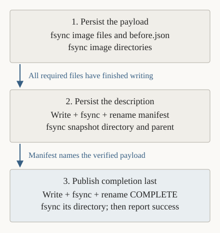

# Plan: train, save to storage, and resume independently

**Proposed; awaiting approval.** This is a documentation change on
`feat/lora-snapshot`. After review, the user merges the current PR and creates a
new implementation branch from updated `main`. Implement and commit each
milestone there; no runtime change or merge is part of this revision.

Read this page from the overall behavior down to the storage guarantee and
implementation steps. The [technical details](independent-lifecycle-details.md)
contain exact file layouts, persistence ordering, process ownership, and failure
handling. The diagrams are ordinary SVG images, so this page does not require a
Mermaid renderer.

## 1. The change in one example

A trainer is learning on the GPU. An external request arrives. A separate command
saves the running trainer as files and exits. Minutes later, another command
reads those files and reconstructs the trainer so it can continue.

The key requirement is **independence**: the capture worker and its launcher can
be gone before the restore command starts. Saved files and the documented
execution environment connect the two operations.

| Program | What it owns |
| --- | --- |
| `train.py` | The model, optimizer, and training loop. It can pause after finishing its current update. |
| `checkpoint.py` | Capture an existing trainer, ensure the files are persisted, publish completion, and exit. |
| `restore.py` | Read a completed snapshot, reconstruct the trainer, verify its state, allow continuation, and exit. |

A **process** is a running instance of a program, with its own memory. These are
three independently runnable entrypoints; CRIU and NVIDIA also create helper
processes. The first demonstration uses scripted requests. A future warning
receiver can invoke the same capture command.

Today, the trainer is separate but one controller performs capture and restore
within the same run. This plan separates those two operations and replaces the
preselected pause update with an externally requested pause.

## 2. Follow one capture and restore

Suppose a request arrives during update 2. The trainer finishes that entire
update before acknowledging the pause. That includes its optimizer, learning-rate
schedule, next-input position, and outstanding GPU calculations. It then waits;
it does not begin update 3 or consume more training randomness.

*Read downward in time. Arrows mean “next phase,” not byte movement. Update 2 is
an example; the saved record names whichever update actually acknowledged the
request. CRIU and its CUDA plugin perform the capture and reconstruction.*

The original trainer exits during our chosen terminating CRIU dump. The capture
worker separately verifies that exit and observes GPU availability afterward.
Finishing the dump is followed by the storage-completion steps below. The tiny
independent GPU job B runs between capture and restore as evidence that another
job can use the GPU; its runtime is reported separately.

Restore first reconstructs the trainer at its saved wait. It observes the restored
state **before changing settings or permitting another update**. A match allows
training to continue. Restoring is not a fresh run of model initialization.

## 3. How the checkpoint gets from RAM to the drive

**VRAM** is the GPU's working memory. **RAM**, or host memory, holds CPU-side state.
Both are live memory. A completed save must reach the chosen persistent storage
volume, not just another area of RAM.

NVIDIA's checkpoint mechanism first copies GPU data into driver-managed host
memory. CRIU can then include that staged data with the required CPU/process
state in its image files. The CUDA plugin coordinates NVIDIA's operations; our
Python worker does not separately copy tensors or invoke a second GPU restore.
[NVIDIA describes this staging step](https://github.com/NVIDIA/cuda-checkpoint#the-utility).

*These arrows represent the data path. CPU state and kernel-resource descriptions
also contribute to the image. The page cache is RAM owned by Linux, separate from
the trainer's memory. Copies and writeback can overlap; this is a conceptual path,
not a claim that each stage holds a complete extra image.*

A normal file write may finish after Linux accepts the bytes into its **page
cache**, a RAM cache for file contents. The filename may be visible and the file
may even read back correctly while writes are still pending. A successful write
alone does not establish persistence. [Linux write semantics](https://man7.org/linux/man-pages/man2/write.2.html).

The worker therefore asks Linux to **synchronize** the finished files with
storage. `fsync(file)` waits for storage to acknowledge the file's data and
required metadata. A **directory** records names pointing to files; synchronizing
a file does not automatically persist its name, so affected directories must be
synchronized too. [Linux fsync semantics](https://man7.org/linux/man-pages/man2/fsync.2.html).

## 4. When we are allowed to say “saved”

The planned command reports success only after this ordered protocol:

1. **Finish capture.** Require CRIU success, evidence that the CUDA plugin ran,
   and the expected image files. Verify original exit separately.
2. **Check and persist the payload.** Record file sizes and hashes, then
   synchronize every required image and diagnostic boundary file, plus their
   directory entries. A hash checks which bytes we have; it does not flush them.
3. **Persist the manifest.** Save a small description of the snapshot, its files,
   and required environment. Synchronize that file and the directories needed to
   find the snapshot after a restart.
4. **Publish completion last.** Write and synchronize a temporary completion
   record, rename it to `COMPLETE`, then synchronize its directory. Only then
   return success and record `local_snapshot_published`.

*Arrows mean ordering dependencies. `COMPLETE` is a record of a completed protocol,
not an operation that itself flushes the large image files. Exact calls and error
handling are in the [storage protocol](independent-lifecycle-details.md#2-exact-local-storage-protocol).*

A write, sync, or publication error makes the command fail. Keep the previous
completed snapshot untouched. If an error occurs after the completion name becomes
visible, treat the attempt as ambiguous rather than reporting success or trusting
the filename alone; the technical protocol defines how restore handles this.
Because the original may already have exited, a failed save cannot promise to
recover its latest work automatically.

**Already implemented:** the current controller runs `sync -f` after CRIU capture
in [pipeline.py](../experiments/finetuning/pipeline.py). That requests completion
for the filesystem containing the run directory. The new plan makes the specific
snapshot's file/directory ordering and final publication explicit. These are
planned changes, not newly measured storage guarantees.

**What this proves:** successful completion of the selected filesystem/storage
flush contract. It assumes the storage stack correctly honors its acknowledgements.
It does not prove recovery after deleting that storage volume. On EC2, EBS
retention depends on configuration such as `DeleteOnTermination`; saving to an
instance-associated volume alone is not enough. A later recovery experiment must
choose retained storage or publish a remote copy.
[AWS volume-retention documentation](https://docs.aws.amazon.com/AWSEC2/latest/UserGuide/preserving-volumes-on-termination.html).

## 5. What we will verify

| Check | Evidence it supplies |
| --- | --- |
| Ordered writes, file/directory syncs, and persisted completion | The worker followed the local persistence protocol before reporting success. Injected write/sync failures must reject success and preserve the previous snapshot. |
| Fresh restore command after capture worker exit | Recovery does not depend on the capture worker's live memory or Python objects. This alone is not a power-loss test: Linux may retain file cache. |
| Matching saved/restored state and subsequent updates | The resumed trainer behaves like uninterrupted training, including active dropout and advancing CUDA randomness. |
| Missing/corrupt files, stale requests, or mismatched state | Restore rejects invalid input and never releases a failed inspection into training. |

Use a CPU-only ownership/publication check first, then capture after one real
LoRA update, restore, and compare the next update. Keep ordinary trials at four
updates and aim for 2–3 minutes per warm diagnostic iteration. Setup, downloads,
reference generation, and the whole acceptance matrix are outside that target.
A reboot or abrupt-storage-loss experiment would be separate evidence; this plan
does not label a same-host restore as proof of either.

## 6. Implement in six small milestones

Each milestone receives its own verified commit on the later implementation
branch. Keep existing reference and application-checkpoint comparisons usable.

| Milestone | Result required before moving on |
| --- | --- |
| 1. Ownership and file protocol | A CPU-only check establishes who collects exited processes and proves a restored child can outlive its worker. Control records, exclusive operations, and failed publication behave correctly. |
| 2. Externally requested pause | Trainer acknowledges a request only after a complete update; stale, cancelled, and late requests have explicit outcomes. |
| 3. Independent capture | `checkpoint.py` captures, verifies exit and GPU availability, persists the payload/manifest/completion in order, and exits. Job B succeeds. |
| 4. Independent restore | `restore.py` reconstructs from saved artifacts, verifies untouched state, exits, and the trainer completes the matching next update. |
| 5. Full comparison | Harness launches the separate commands; dropout 0 and active 0.1, application restart, and two sequential capture/restore generations pass. |
| 6. Measured evidence and teaching | Update runnable examples, code explanations, results, and metrics; measure actual turnaround and validate timing calculations. New comparative performance claims need fresh paired measurements. |

## 7. Then read the implementation details

The code stays deliberately small: add `checkpoint.py` and `restore.py`, retain
one training loop, and use a small `control.py` for shared records and publication.
Keep OS/CRIU calls in the existing `session.py`. The experiment harness invokes
the commands and collects evidence; it does not become required recovery state.

Continue with [files, exact persistence steps, process ownership, and failure
rules](independent-lifecycle-details.md). That companion document preserves the
contracts needed for implementation without making them the starting point for
a reader. Comments should explain non-obvious blocks and introduce the OS
concepts they use, following the [teaching plan](readability-plan.md).

The scope remains the pinned single-host, single-GPU FP32 LoRA workload. AWS
warning detection, remote upload, replacement-host restore, older-snapshot replay,
distributed training, and inference experiments remain later work. Keep unresolved
shared-memory/resource warnings visible even when numerical continuation passes.
