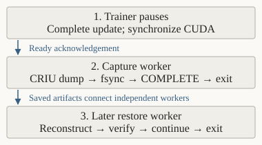
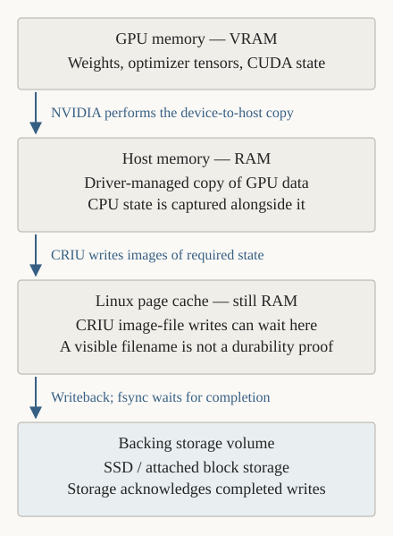

# Plan: independent capture and restore

**Proposed; awaiting approval.** Review and merge the current PR first; the user
then creates a new implementation branch. Commit each milestone after validation.

## Architecture

Split the current controller into independently runnable entrypoints:

| Entrypoint | Responsibility |
| --- | --- |
| `train.py` | Train and acknowledge external pause requests at completed-update boundaries. |
| `checkpoint.py` | Capture the existing trainer, verify exit, persist the snapshot, and exit. |
| `restore.py` | Validate the snapshot, reconstruct the trainer, compare state, release continuation, and exit. |

Restore must work after the capture worker and its launcher are gone. The
restored trainer must survive the restore worker's exit. Shared records belong
in a small `control.py`; privileged CRIU operations remain in `session.py`.
The experiment harness launches commands and verifies results, without becoming
required recovery state.

*Arrows indicate execution order. Capture and restore are separate invocations.*

A pause follows optimizer/scheduler steps, gradient clearing, cursor updates, and
CUDA synchronization. The trainer waits without fetching inputs or advancing RNG.
CRIU's CUDA plugin owns GPU transitions. After terminating dump, verify original
exit and GPU availability; run job B separately before restore. Inspect restored
state before changing settings or permitting another update.

## Storage completion

NVIDIA stages GPU data in host RAM; CRIU writes the required process state into
image files. Those writes can remain in Linux's page cache, which is also RAM.
[NVIDIA mechanism](https://github.com/NVIDIA/cuda-checkpoint#the-utility).

*Arrows indicate data movement; `fsync` requests and waits for storage completion.*

Before reporting success:

1. Require successful dump and plugin evidence; inventory and hash the payload.
2. `fsync` payload files and directories. Persist the manifest and snapshot's
   parent-directory entries.
3. Write, `fsync`, and rename `COMPLETE`; `fsync` its directory. Persist the
   terminal operation phase, then report success.

A hash verifies content, not persistence. File sync does not persist its directory
entry automatically. [Linux fsync](https://man7.org/linux/man-pages/man2/fsync.2.html).
The current controller uses `sync -f`; this plan specifies per-snapshot publication.
Any failed or ambiguous publication is ineligible pending revalidation; preserve
the previous snapshot. The protocol relies on filesystem/device guarantees;
volume-deletion and abrupt-host-loss recovery are not tested in this phase.

## Implementation milestones

| Commit | Required result |
| --- | --- |
| 1. Ownership and protocol | CPU checks establish exit/reaping, descendant survival, operation exclusion, and publication failure handling. |
| 2. External pause | Requests take effect after complete updates; stale, late, and cancelled requests have bounded outcomes. |
| 3. Capture command | Independent capture, verified exit/GPU handoff, persisted snapshot, worker exit, and successful job B. |
| 4. Restore command | Fresh worker restores from artifacts, verifies untouched state, exits, and training performs the matching next update. |
| 5. Comparisons | Fresh references, application/CRIU routes at dropout 0 and active 0.1, and two sequential capture/restore generations pass. |
| 6. Evidence | Update commands/docs, validate timing, and report actual warm-trial duration. New performance claims require paired repetitions. |

## Scope and acceptance

Keep the pinned same-host, single-GPU FP32 LoRA workload: one-update capture first,
then four-update trials targeting **2–3 minutes** warm. Setup, downloads, reference
generation, and the full matrix are outside that target.

Require exact named-state and continuation comparisons, actual dropout execution
and CUDA RNG advancement, rejection of invalid artifacts, and failure injection
for write/sync/publication. Keep lifecycle, numerical, and compatibility verdicts
separate; sharing/resource warnings remain qualified.

AWS triggers, remote upload, replacement-host recovery, older-snapshot replay,
distributed training, and inference remain outside this change. See the
[implementation contract](independent-lifecycle-details.md) for file layout,
exact persistence ordering, ownership, and error handling.
