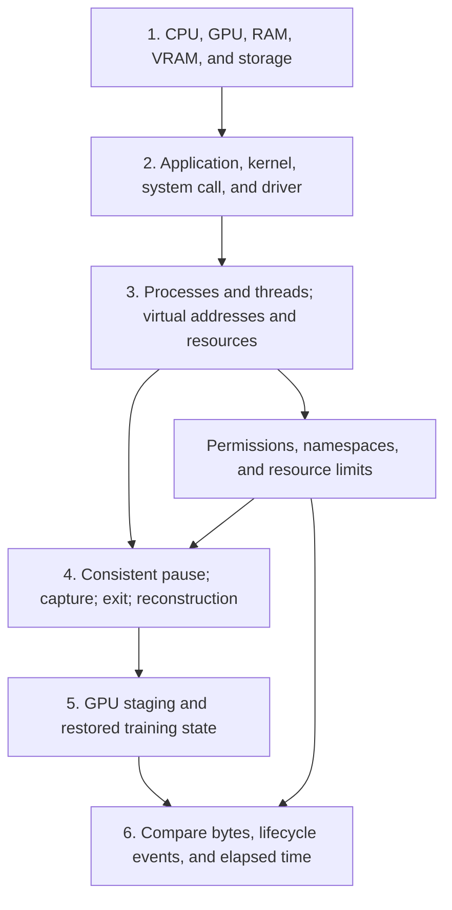

# Plan: make the POC readable without an OS course

The reader knows variables, functions, loops, and basic Python. They need not know
how Linux runs a process, what a memory mapping is, or why restoring a clock can
break a measurement. Explain each prerequisite before using it to justify code.
Explain training terms such as adapters, optimizer history, and random-generator
state on first use too.

This is a teaching and code-organization change. Preserve the bounded experiment,
its command-line interface, evidence fields, and qualified conclusions. Record
measured validation separately from planned work; inference experiments remain
outside this change.

## What is already explained, and what is missing

The [README](../README.md#start-with-the-machine) already distinguishes CPU, RAM,
GPU, VRAM, storage, program, process, kernel, library, and driver. The
[CPU chapter](01-cpu-checkpointing.md) explains threads, virtual addresses,
pointers, stacks, registers, file descriptors, and CRIU's reconstruction stages.
The [GPU chapter](02-gpu-checkpointing.md) explains asynchronous execution, GPU
staging, and the difference between application and process checkpoints. Keep
these explanations and improve the missing connections rather than start over.

The largest gaps are the OS concepts used by the controller: parent/child
processes, exit and reaping, signals, permissions, namespaces, buffered file
writes, memory accounting, and clock offsets. A reader can currently understand
the checkpoint diagram and still struggle to explain `session.py` or `metrics.py`.

## Teach prerequisites in this order

Each arrow means “understand this before the next explanation.” These are
learning dependencies, not a hardware data path. Use the same four-update example
through the chapters and code walkthrough: finish update 2, capture, end the
original, restore, inspect, and then permit update 3.

| Teaching location | Explanation to add or strengthen | Code that needs the connection |
| --- | --- | --- |
| README, “Start with the machine” | Distinguish application execution in user space from privileged kernel work. A system call requests a kernel service. A driver manages device operations; importing a Python library does not itself grant permission to control another process. | `session.launch()`, `session.criu()` |
| CPU chapter, “A process is more than its variables” | Introduce a PID as Linux's process identifier and explain parent/child creation. Define a page as a block of memory managed by the OS. Extend the existing pointer explanation with private versus shared mappings: two processes may refer to the same underlying bytes, so copying their contents separately can lose a relationship. | `session.alive()`, `/proc/<pid>/maps`, the shared-memory qualifications in results |
| CPU chapter, “State held by Linux” | Show a file descriptor pointing to an open-file description containing the current position. Distinguish that kernel-held record from the file's bytes. Define a pipe, socket, and standard input/output/error before their use in process launch. Explain a terminal, process group, and session, including how a controlling terminal connects a session to interactive input and signals. | `session.launch()` and `start_new_session=True`, `session.command()`, `session.criu()` and `--shell-job`, `cpu_counter.run()` |
| CPU chapter, “The original process can be gone” | Explain running, exited-but-not-collected (zombie), and reaped states. A parent collects an exited child's status with `wait`; exit and removal of its process record are separate events. Explain PID reuse, a detached restored process, and why this controller adopts descendants using a subreaper. | `session.adopt_restored_children()`, `alive()`, `reap()`, `cleanup()` |
| CPU chapter, next to stopping and cleanup | Define a signal as an OS notification/request to a process; distinguish stopping execution, requesting termination, and forceful termination. Explain that `SIGKILL` in failure cleanup is not the normal save protocol. Explain the run-path identity check before signaling a PID, without claiming it eliminates every possible PID-reuse race. | `session.cleanup()`; CRIU's controlled thread stop versus controller cleanup |
| CPU chapter, “Permissions and external boundaries” | Define user/group identifiers (UID/GID), file ownership, root, and Linux capabilities as permissions for particular privileged operations. Explain read/write/execute bits, directory traversal, `0700` as owner-only access, and how `umask` restricts permissions of newly created files. Explain a namespace as an isolated view of an OS resource, such as process IDs or clocks. A container combines mechanisms; it does not own a separate Linux kernel or guarantee permission to restore processes. | `run.run()` and `os.umask`, `session.criu()` and `chown`, environment probes, restored time namespace |
| GPU chapter, “Submission is not completion” and coordination | Connect threads, queued GPU work, `torch.cuda.synchronize()`, and the completed-update boundary. Explain why a CUDA helper thread sometimes needs to run while ordinary application threads are controlled. Keep GPU lock, CPU pause, and completed on-disk image distinct. | `train.main()`, `criu_pipeline.run()`, native CRIU CUDA plugin |
| GPU chapter, “Follow the bytes and the time” | Define user-space buffering, kernel page cache, file publication by rename, file/directory `fsync`, and filesystem `sync`. Explain visibility versus persistence and why local completion alone does not establish survival of instance deletion. | `state.save_application()`, `pipeline.handoff()` |
| GPU chapter, measurements; runnable README | Explain elapsed time versus calendar time, a monotonic clock, and a namespace clock offset. Derive `controller_time = trainer_time - trainer_offset + controller_offset` using a small numeric example. Explain why durations measured entirely within one process do not need the conversion. | `metrics.latencies()`, `metrics.finish()` |
| GPU chapter, memory sizing; runnable README | Define resident memory (RAM currently backing a process), sampled peaks, the kernel's high-water mark, and control groups (cgroups) that account for and limit groups of processes. Explain that ancestor limits can apply, and cgroup usage can include file cache and other processes. | `metrics.sample_memory()`, `train.memory()` |

Keep the fundamental definitions beside their first use, with descriptive links
back from later chapters. A glossary may help navigation but must not replace
these explanations. Check OS-specific details against Linux documentation and
the pinned tool source when expanding the chapters; link the relevant primary
source beside the behavior it supports.

## Keep the implementation small and traceable

The readability refactor separates each comparison pipeline into its own file.
Use this reading order to connect each route to its shared operations.

| File | One responsibility |
| --- | --- |
| `experiments/finetuning/run.py` | Validate inputs, select a pipeline, and decide final lifecycle/numerical verdicts. |
| `reference_pipeline.py` | Run two uninterrupted references; the controller compares them before permitting reuse. |
| `application_pipeline.py` | Save explicit training state, exit, and construct a fresh trainer from that save. |
| `criu_pipeline.py` | Capture and reconstruct the existing trainer with the native CRIU CUDA plugin. |
| `pipeline.py` | Share actual lifecycle operations: boundary, handoff, inspection, and final comparison. |
| `train.py` and `state.py` | Perform updates; describe, compare, save, and load the training state. |
| `experiments/criu/session.py` | Launch processes, invoke CRIU, wait, collect exit status, and clean up. |
| `metrics.py` and `report.py` | Calculate measurements and collect the selected evidence. |
| `job_b.py` | Allocate GPU memory and check a reduction while the trainer is absent. |

Keep one straight-through function for each pipeline. Extract a helper when it
names a meaningful operation, removes real duplication, or isolates a subtle
contract. Avoid one-line wrappers, a generic workflow framework, and extra
classes that only forward arguments. Minimize the concepts a reader must hold at
once, rather than pursuing the fewest source lines.

Every function should explain its purpose and any important side effects,
preconditions, or returned state. Add comments beside non-obvious blocks that
explain what happens and why that order matters. One comment can cover a short
sequence; ordinary assignments, imports, and obvious loops need no narration.
Name intermediate values when a dense expression obscures the operation.

For example, the comment at `waitpid` should explain collecting an exited child's
status, while the CPU chapter teaches parent/child and zombie concepts. The
comment at clock conversion should state the equation and sign convention, while
the GPU chapter teaches clock domains. Avoid copying whole lessons into several
functions where they can drift apart.

Preserve the important contracts throughout: inspect restored state before any
repair, restore application RNG state last, use fresh files for each capture,
verify original exit before GPU handoff, and give NVIDIA restoration exactly one
owner. Keep diagnostic inspection separate from timing measurements.

## Diagrams and a code walkthrough

Use a small number of diagrams that answer concrete questions:

1. **Memory:** two processes, their virtual addresses, and private/shared backing
   pages. Show why equal bytes do not establish preserved sharing.
2. **Lifecycle:** controller starts trainer; trainer exits; controller reaps it;
   CRIU reconstructs a process. Distinguish a reused numeric PID from continued
   existence of the original process.
3. **Protocol:** a sequence diagram with controller, trainer, CRIU/plugin, GPU,
   and files. Label marker files as control requests, and label RAM/VRAM/image
   arrows as data movement. Show the restored inspection wait before update 3.
4. **Measurement:** event timeline with image completion, verified original exit,
   post-exit GPU observation, filesystem sync, and next completed update. Put the
   trainer/controller clock conversion beside the one interval that crosses them.

Keep the existing interactive CRIU walkthrough. Add interaction only if it helps
follow changing state; retain keyboard controls, a text equivalent, and no
autoplay. Static Mermaid is sufficient for the other relationships.

Add a code reading section to the runnable README that follows one CRIU capture
through named functions and marker files, then explains the two differences in
the application pipeline: explicit serialization and fresh initialization.
Link to chapter explanations at the exact points where OS concepts enter.

## Milestones and acceptance

1. **Code organization and inline explanations — implemented.** Dedicated
   pipeline files and comments cover training, state, lifecycle, and measurement
   code. Six agents split implementation, teaching design, and independent review.
   The code and cleanup regression fix are separate feature-branch commits.
   Verification is a separate milestone below.
2. **OS foundations — planned documentation expansion.** Fill the chapter gaps
   above in prerequisite order, including the memory and lifecycle diagrams.
   Accept when a reader can explain why bytes, file positions, execution state,
   sharing relationships, and collected process exit are separately relevant.
3. **Walkthrough and measurement lesson — partly implemented.** The runnable
   README now follows commands, pipeline functions, and marker files through one
   restore. Expand its chapter links and add the longer storage, memory-accounting,
   and clock lessons. Accept when the reader can trace update 2 through restore
   to update 3 and calculate intervals without assuming shared clock origins.
4. **Code validation — completed; full chapter reading pass — planned.** Fourteen
   CPU checks and nine fresh GPU cases passed on September 17, including active
   dropout, both restore routes, repeated capture, and the timing paths. See the
   [validation record](../experiments/results.md#readability-refactor-validation--2026-09-17).
   Six-agent review checked the code organization and prerequisite coverage;
   relative document links and source syntax were checked. After the chapter
   expansion, read each route without relying on unexplained OS vocabulary and
   check its diagrams and links. Commit each finished milestone separately; the
   user reviews and merges.

Before modifying or reviewing tests, follow the repository's `writing-tests`
skill. Comments and prose do not need tests that merely repeat their wording.
Do not regenerate headline performance claims from a readability pass. Preserve
dated measurements, compatibility qualifications, and the boundary between
same-host continuation and untested spot, migration, or inference scenarios.

The inline refactor and short code walkthrough are implemented. The deeper OS
chapter expansion, its additional diagrams, and the full measurement lesson
remain planned. Record post-refactor validation separately from those teaching
milestones; a passing workload does not establish that a chapter is understandable.
