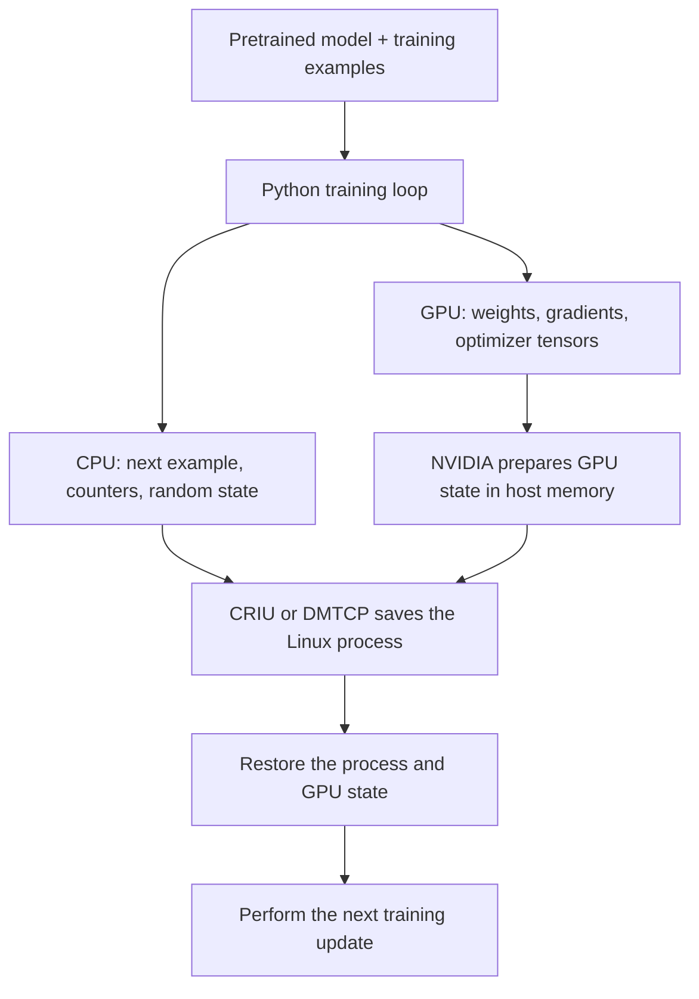
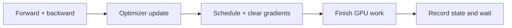
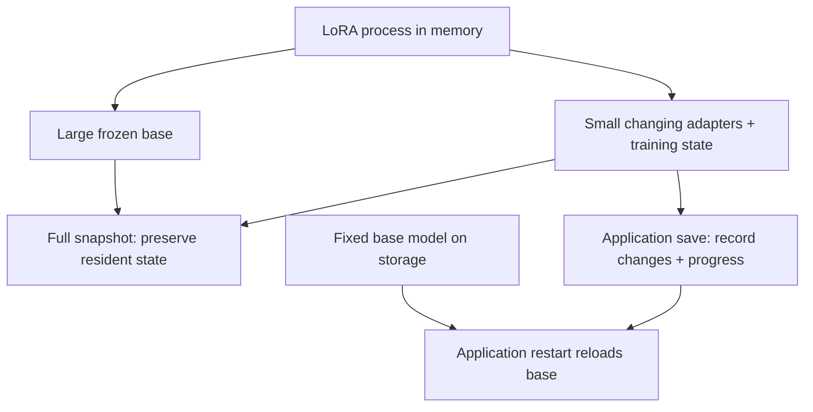

# Single-GPU fine-tuning snapshots

**Single-GPU fine-tuning is a sensible next experiment. The checkpoint mechanism stays broadly the same; the training state, compatibility checks, and economic comparison become more demanding.** Start with a small pretrained model, ordinary LoRA, and a non-paged optimizer. Compare restoring the whole process with restarting from a complete training checkpoint.

**September 14 feasibility update:** DMTCP's newer native CUDA plugin provides a route around this container's blocked CRIU permission path. A live experiment restored a complete PyTorch GPU process from disk after original exit, with matching tensor data and working subsequent GPU computation. Anonymous shared-memory warnings remain unresolved, and the LoRA training-state acceptance experiment below has not yet run. The older CRAC prototype is not the only DMTCP CUDA option. See the [measured results](../experiments/results.md).

Companies already implement GPU snapshots. NVIDIA supplies the driver mechanism; MemVerge and Cedana document workload checkpoint/restore; Modal, Beam, Google Cloud, and NVIDIA Dynamo expose related startup features. Their documented scope varies, especially between resuming training and starting an initialized inference worker. The company comparison below makes that distinction explicit.

This report covers language-model supervised fine-tuning: learning from examples with desired outputs, on one NVIDIA GPU. It compares full fine-tuning, LoRA, and quantized LoRA. Proposed acceptance checks remain future work; host and mechanism measurements are identified as such. Product documentation was checked on September 13, 2026; the DMTCP feasibility evidence was checked on September 14, 2026. Individual papers and version constraints are identified below.

## 1. What changes from the mechanism probes

The implemented probes cover a deterministic CPU counter, NVIDIA-only suspension of a tensor process, and DMTCP restoration of that complete GPU process. No training model exists in the repository yet. Fine-tuning would add a pretrained language model, tokenized text, optimizer history, and data position. CUDA still sees allocations, kernels, and streams; it does not need a special “fine-tuning snapshot” operation. The driver prepares supported GPU state for capture; CRIU or DMTCP preserves the CPU process around it. [NVIDIA cuda-checkpoint](https://github.com/NVIDIA/cuda-checkpoint), [CRIU GPU integration](https://www.criu.org/GPU_Checkpointing), [DMTCP CUDA plugin](https://github.com/dmtcp/dmtcp/tree/b175bb5ccadd2f02d11cf052f586d2d9ac62ad53/plugin/cuda).



The important change is the amount and meaning of the state. A model can produce sensible text after an incomplete restore while its training trajectory has already changed.

| State to preserve | Why it matters after resume |
| --- | --- |
| Trainable weights | They contain the learning completed so far. |
| Optimizer state | Adam keeps moving averages of gradients and squared gradients. Losing them changes subsequent updates. |
| Learning-rate schedule and update count | They determine the size of the next update. |
| Random-generator states | They determine dropout and other random choices. Preserve each generator actually used. |
| Dataset order and next example | Restarting at the wrong position repeats or skips training examples. |
| Partially accumulated gradients | Needed if the snapshot occurs before a complete optimizer update. Avoid this boundary initially. |
| Precision-related state | FP16 training may use a gradient scaler; quantized weights have representation metadata. Include these when present. |
| Python objects and CUDA resources | A process snapshot preserves execution machinery that an application restart normally rebuilds. |

Framework support already exists for much of the explicit training state. Accelerate saves models, optimizers, random generators, and gradient scalers, and supports registering additional stateful objects. Dataset position still needs deliberate handling. [Accelerate checkpointing](https://huggingface.co/docs/accelerate/usage_guides/checkpoint).

**One GPU does not automatically mean one process.** Data loading, experiment tracking, and compilation can introduce workers or external services. Our proposed baseline uses already-tokenized local examples, no data-loader worker processes, and local logs. PyTorch documents the distinction between loading data in the main process and using multiple workers. [PyTorch data loading](https://docs.pytorch.org/docs/stable/data.html).

### Choose a complete update as the pause point

A training update is: compute predictions, compute the loss, run the backward pass, update weights, update the learning-rate schedule if applicable, and clear gradients. With gradient accumulation, several small batches contribute to one update. The checkpoint boundary should come after that whole update.



At the boundary, use an explicit readiness/release handshake, rather than a short sleep. The shell must see readiness; the training process must wait until restore is finished before proceeding. Drop references to temporary outputs where appropriate. A completed backward pass does not mean every allocated byte has been returned to the driver: PyTorch retains reusable memory in its caching allocator. Measure both allocated and reserved memory. [PyTorch 2.11 memory management](https://docs.pytorch.org/docs/2.11/notes/cuda.html#memory-management).

This is **a cooperative pause point with transparent state capture**. It deliberately makes correctness easy to inspect. It does not establish that every arbitrary interruption point works.

## 2. Full fine-tuning, LoRA, and QLoRA

**Full fine-tuning** changes the base model's weights. **LoRA** freezes those weights and learns small additional matrices, called adapters. The original model still participates in the computation and still occupies memory. [Hu et al., LoRA, 2021](https://arxiv.org/abs/2106.09685).

**QLoRA** combines a low-bit representation of the frozen base model with trainable adapters. Its original design also introduced paged optimizers to handle memory pressure. Quantization and optimizer paging are distinct choices in an implementation. [Dettmers et al., QLoRA, 2023](https://arxiv.org/abs/2305.14314).

| Method | What an application checkpoint can save | What a basic process snapshot must account for |
| --- | --- | --- |
| Full fine-tuning | Updated model, optimizer, and other training state | The same learning state, plus the process and CUDA environment |
| LoRA | Adapters and their optimizer state, other training state, and a reference to the fixed base model | The resident base model as well as adapters and process state |
| QLoRA | Adapters, optimizer and other training state; exact base/quantization configuration | Quantized resident base, its metadata, adapters, runtime state, and any supported allocations |

PEFT's adapter export intentionally omits the base model. That is useful for a compact artifact, but an adapter export alone is not a full training-resume checkpoint: optimizer, schedule, data position, and random state need their own handling. [PEFT checkpoint format](https://huggingface.co/docs/peft/developer_guides/checkpoint).

### The central tradeoff for LoRA

Imagine an unchanged 7-billion-parameter base represented with two bytes per parameter. Its raw weights alone are approximately **14 GB**, before temporary memory or runtime overhead. Four bits per parameter would be approximately **3.5 GB**, before quantization metadata and higher-precision components. These are arithmetic illustrations, not observed memory use or model fit guarantees.

An application knows that the base can be loaded again from a fixed model revision. A general snapshot mechanism sees live allocations; it cannot infer the same saving from `requires_grad=False` without additional support. Consequently, the portion we train may be small while the portion we snapshot remains large. **LoRA can make application checkpointing more attractive even while making the training job itself cheaper.** This is an analytical consequence of the different saved state, not a claim that snapshots always lose.



For full fine-tuning, application checkpoints also become large because all model weights change and optimizer state grows. That narrows this particular size advantage. Actual pause and resume times still need measurement.

## 3. Compatibility issues that matter first

### Current-host route and its qualification

DMTCP v4.2.0 introduced a native NVIDIA CUDA plugin in June 2026. The successful local lifecycle and numerical probe used maintenance commit `b175bb5ccadd2f02d11cf052f586d2d9ac62ad53` from September 7, 2026, which includes later CUDA helper-thread and PyTorch mapping fixes. The application must be launched through DMTCP; unlike CRIU, this is not external attachment to an arbitrary running process. [DMTCP release](https://github.com/dmtcp/dmtcp/releases/tag/v4.2.0), [pinned plugin](https://github.com/dmtcp/dmtcp/blob/b175bb5ccadd2f02d11cf052f586d2d9ac62ad53/plugin/cuda/cuda-ckpt.cpp).

The probe's process image restored after the original exited and passed tensor and subsequent GPU-operation checks. It also emitted four warnings for writable `/dev/zero (deleted)` shared mappings. DMTCP saves their bytes but restores them as private anonymous mappings, so an original sharing relationship can be lost. This matters only if the workload depends on that relationship, but its ownership has not yet been established. Treat the result as a successful lifecycle and data probe with unresolved compatibility, not an unqualified fine-tuning pass. [DMTCP shared-memory serialization](https://github.com/dmtcp/dmtcp/blob/b175bb5ccadd2f02d11cf052f586d2d9ac62ad53/src/writeckpt.cpp#L479-L494).

Kernel-backed anonymous mappings are a separate case. For example, an `io_uring` mapping depends on a kernel-managed asynchronous-I/O object; restoring its bytes does not recreate that object. The GPU probe did not contain such a mapping, but this warning should reject any later workload that does. [Pinned mapping diagnostics](https://github.com/dmtcp/dmtcp/blob/b175bb5ccadd2f02d11cf052f586d2d9ac62ad53/src/plugin/ipc/file/fileconnlist.cpp#L451-L463).

The maintenance branch contained the PyTorch `libgomp` mapping correction and the anonymous kernel-backed mapping diagnostic. Branch inclusion was checked separately from the status of the corresponding pull requests; a merged or closed badge is not the evidence that identifies the tested source. [DMTCP PR 1299](https://github.com/dmtcp/dmtcp/pull/1299), [DMTCP PR 1300](https://github.com/dmtcp/dmtcp/pull/1300).

The tested runtime was PyTorch 2.11.0+cu130 on driver 595.58.03. System CUDA development files were 12.6, so the plugin build required isolated CUDA 13 runtime headers 13.0.96 and NVCC/CRT headers 13.0.88. This mismatch is a reproducibility constraint: `torch.version.cuda` and a Makefile version banner do not alone identify the headers used to compile a plugin.

### Paged optimizers are the most concrete QLoRA trap

bitsandbytes documents paged optimizers as using CUDA unified memory, which lets memory be managed across the CPU and GPU. In audited version 0.49.2, its implementation calls `cudaMallocManaged` for sufficiently large paged buffers. The tested NVIDIA checkpoint revision lists UVM as unsupported. This creates a specific incompatibility to avoid in the first candidate experiment. [bitsandbytes optimizer explanation](https://huggingface.co/docs/bitsandbytes/explanations/optimizers), [version 0.49.2 optimizer path](https://github.com/bitsandbytes-foundation/bitsandbytes/blob/0.49.2/bitsandbytes/optim/optimizer.py#L329-L337), [version 0.49.2 managed allocator](https://github.com/bitsandbytes-foundation/bitsandbytes/blob/0.49.2/csrc/pythonInterface.cpp#L604-L610), [pinned NVIDIA limitations](https://github.com/NVIDIA/cuda-checkpoint/blob/00d5cce84c628088d6caa203fc4af40c1538b6f7/README.md).

The code path is inspectable: `get_state_buffer()` chooses paged buffers when paging is enabled and a tensor meets its size threshold; the native allocator uses `cudaMallocManaged`. Smaller tensors can take the ordinary allocation path. Probe after optimizer state is initialized, not merely after loading the model. Managed allocation can exist before any visible paging under memory pressure.

**Recommendation:** start with plain `torch.optim.AdamW` over the trainable adapter parameters. Later, add four-bit base weights while retaining a non-paged optimizer. A successful ordinary LoRA run does not prove bitsandbytes compatibility; a paged-optimizer failure does not prove all QLoRA is impossible.

### Other boundaries

| Concern | First-experiment choice and reason |
| --- | --- |
| CUDA work still running | Wait at the completed update boundary. Driver checkpointing drains submitted work; it does not save a kernel halfway through execution. |
| CPU keeps advancing | Hold an explicit release gate until the restored CUDA state is ready. CUDA suspension alone is not CPU process freezing. |
| Host RAM | Leave room for the active CPU process plus staged GPU memory and checkpoint overhead; GPU fit alone is insufficient. |
| Software and hardware | Restore on the same host and GPU with the same environment. Cross-host portability is a separate experiment. |
| Compilation and optimized kernels | Start with eager execution; introduce compilation or additional kernel libraries one at a time after the baseline. |
| External state | Keep data and logs local and controlled. Restoring memory cannot roll back an external upload or reset another service's clock. |

The driver behavior above is described by NVIDIA; the experiment restrictions are our scope choices, not claims that all excluded features are fundamentally unsupported. The tested revision excludes specified IPC mechanisms, and legacy CUDA IPC support belongs to driver 610 rather than the installed 595 series. Changing the CPU capture tool does not add that driver capability. [Pinned NVIDIA feature and limitation list](https://github.com/NVIDIA/cuda-checkpoint/blob/00d5cce84c628088d6caa203fc4af40c1538b6f7/README.md).

**“Gradient checkpointing” means something else.** It saves training memory by discarding selected intermediate results and recomputing them during the backward pass. It does not create a restartable process snapshot. We can add it later if memory pressure requires it. [PyTorch activation checkpointing](https://docs.pytorch.org/docs/stable/checkpoint.html).

## 4. Papers most relevant to this project

These papers answer different questions. Training experiments establish more than a model-loading demo, but neither automatically establishes our precise LoRA or QLoRA configuration.

### CRIUgpu — closest to our implementation path

Stoyanov et al., February 2025, describe integrating vendor GPU capture with CRIU, including language-model training. Their single-H100 Llama 3.1 8B experiment reports **77.40 seconds to checkpoint, 38.83 seconds to restore, and a 55.89 GB unified snapshot**. The setup used an older driver and HDD storage; these figures are not predictions for our L4. The paper does not establish a tested LoRA/QLoRA recipe.

Read its workflow, Table 2, and Table 4. Its practical lesson is that saving GPU state to host memory and writing a complete process snapshot are different costs. The implementation path leads to upstream CRIU's CUDA plugin, rather than a new fine-tuning framework. [CRIUgpu paper](https://arxiv.org/html/2502.16631v1), [upstream CUDA plugin](https://github.com/checkpoint-restore/criu/tree/criu-dev/plugins/cuda).

### CRIU-LZ4 — direct fine-tuning evidence, with a useful negative result

Stoyanov et al., EuroMLSys 2026, explicitly evaluate supervised fine-tuning on a single B200. Section 5.3 reports training snapshots shrinking by roughly **1.1–1.6×**, while checkpoint freeze time grows **2–3×** and restore time grows **1.5–1.7×**. Training state compresses less effectively than empty inference caches. The exact adapter/quantization recipe is not specified sufficiently to reproduce our proposed workload.

This is a strong reason to measure compression rather than assume it helps. Current upstream `criu-dev` documentation includes LZ4 compression options; availability must be checked in the actual installed build. [CRIU-LZ4 paper, §5.3 and Figure 9](https://radostin.io/files/stoyanov-euromlsys-2026.pdf), [CRIU compression options](https://github.com/checkpoint-restore/criu/blob/criu-dev/Documentation/criu.txt).

### GCR — the most useful performance paper to read next

Zeng et al., FAST 2026, combine driver-managed control state with separately managed data copying. Their incremental design tracks modified memory, allowing unchanged buffers to be skipped. They report **72.1% lower checkpoint latency** against their NVIDIA baseline; the often-cited **86.6% size reduction concerns inference experiments**. Their implementation stores checkpoints in CPU memory, so these results are not durable disk-checkpoint timings.

Read §§5, 6.1.3, and 6.2 together. The public artifact uses a tested two-A100 environment and specific framework versions. It is a research implementation, not evidence that our modern single-GPU LoRA stack works unchanged. [GCR paper](https://www.usenix.org/system/files/fast26-zeng.pdf), [FAST paper and artifact recognition](https://www.usenix.org/conference/fast26/presentation/zeng), [GCR source and evaluation](https://github.com/thustorage/GCR).

### PhoenixOS — copying while execution continues

Wei et al., SOSP 2025, study overlapping checkpoint/restore with application execution. Their system infers which memory operations matter and validates those inferences. The public Apache-2.0 repository explicitly supports single-GPU checkpoint/restore and describes substantial build machinery and ongoing development.

This is relevant once stopping to copy memory becomes the measured problem. It would add considerable systems work to our first demo. [PhoenixOS paper, September 2025 revision](https://arxiv.org/html/2405.12079v4), [PhoenixOS source and support notes](https://github.com/SJTU-IPADS/PhoenixOS).

### Singularity — why a cloud provider builds this

Shukla et al., Microsoft, February 2022, present a scheduling service that makes deep-learning jobs preemptible, migratable, and resizable through a device-proxy architecture. It connects checkpoint mechanisms to better fleet utilization and reliability.

It helps explain how snapshotting can support GPU scheduling. The publication is not a downloadable, supported single-GPU fine-tuning package. Its 2022 description also does not establish the exact current scope of an Azure product. [Microsoft Research publication](https://www.microsoft.com/en-us/research/publication/singularity-planet-scale-preemptive-and-elastic-scheduling-of-ai-workloads/), [Singularity paper](https://arxiv.org/abs/2202.07848).

### CRAC — evidence that driver limitations are not universal laws

Jain and Cooperman, SC 2020, describe a DMTCP-based design supporting CUDA streams and unified memory. It uses a different architecture from NVIDIA's driver-native utility. The public early-development repository warns of incomplete portability work. It is historical context, not a low-effort fix for today's QLoRA UVM restriction. [CRAC paper](https://arxiv.org/abs/2008.10596), [CRAC source and caveats](https://github.com/DMTCP-CRAC/CRAC-early-development).

The original **LoRA** and **QLoRA** papers explain how training state becomes smaller; they do not claim transparent CPU/GPU process restoration. Keep those research questions separate. [LoRA](https://arxiv.org/abs/2106.09685), [QLoRA](https://arxiv.org/abs/2305.14314).

## 5. Open-source tools and frameworks

There are two layers to choose: the code that trains the model, and the code that captures the running process. A training framework with a `resume` option does not thereby preserve a CUDA process.

| Tool | What it provides | Fit for this POC |
| --- | --- | --- |
| [cuda-checkpoint + CRIU CUDA plugin](https://www.criu.org/GPU_Checkpointing) | Supported GPU state capture combined with Linux process capture. The CLI/plugin are public; GPU internals remain in NVIDIA's driver. | Reference route on an environment with appropriate permissions; blocked in the current container. |
| [DMTCP native CUDA plugin, pinned maintenance revision](https://github.com/dmtcp/dmtcp/tree/b175bb5ccadd2f02d11cf052f586d2d9ac62ad53/plugin/cuda) | NVIDIA driver checkpointing plus DMTCP process images; launch the application through DMTCP. Distinct from historical CRAC. | **Current-host alternative:** real CPU/GPU restoration observed; shared-memory qualifications and full LoRA correctness still need validation. |
| [Transformers + PEFT](https://huggingface.co/docs/peft/developer_guides/checkpoint) | Pretrained models, adapters, and explicit model/adaptor saving. | **First choice for a readable training loop.** |
| [TRL SFTTrainer](https://huggingface.co/docs/trl/sft_trainer) | A supervised fine-tuning trainer built on Transformers Trainer, including training resume. | Add after the explicit loop, to check a common framework path. |
| [Accelerate](https://huggingface.co/docs/accelerate/usage_guides/checkpoint) | Application-state save/load and registration of custom state. | Useful reference or implementation for the application baseline. |
| [torchtune](https://meta-pytorch.org/torchtune/stable/deep_dives/checkpointer.html) | Full and LoRA fine-tuning recipes with model and recipe-state checkpoints. | Another application-level comparator; the cited 0.6 guide describes epoch-end intermediate saves. |
| [GCR](https://github.com/thustorage/GCR) / [PhoenixOS](https://github.com/SJTU-IPADS/PhoenixOS) | Public research implementations of more advanced GPU capture. | Read and reproduce later if measured pause costs justify the effort. |
| [Cedana daemon](https://github.com/cedana/cedana) | AGPL-3.0 orchestration around checkpoint/restore. | Its GPU options include the community CUDA plugin and a separately proprietary Cedana plugin; do not treat the whole stack as open source. |

TRL's resume interface restores model, optimizer, and scheduler state from a Trainer checkpoint. In Transformers, `save_only_model=True` omits state needed for full training resume. Compare against a proper training checkpoint, not merely `save_pretrained()` or a final adapter export. [TRL resume API](https://huggingface.co/docs/trl/sft_trainer#trl.SFTTrainer.train), [Transformers training arguments](https://huggingface.co/docs/transformers/main/en/main_classes/trainer).

Code worth opening while implementing: [PEFT adapter serialization](https://github.com/huggingface/peft/blob/main/src/peft/utils/save_and_load.py), [TRL trainer](https://github.com/huggingface/trl/blob/main/trl/trainer/sft_trainer.py), and the [CRIU CUDA plugin](https://github.com/checkpoint-restore/criu/blob/criu-dev/plugins/cuda/cuda_plugin.c). Check out fixed revisions before reproducing an experiment; these links follow moving development branches.

## 6. Companies already doing related work

“No company implements this” is incorrect. The narrower question is which product documents the ability to resume our kind of training, under which constraints. Documentation is evidence of an offered capability; it is not independent validation of every supported workload or a count of production customers.

| Company / offering | Public evidence | Relevance to single-GPU fine-tuning |
| --- | --- | --- |
| **MemVerge** | GPU Cluster Manager documents pausing/resuming training workspaces. Memory Machine Batch documents single-GPU restore on the same GPU model and full GPU backups. [Workspace guide](https://docs.memverge.com/AI/GPU_Cluster_Manager/0.4.0/quickstart_guide/checkpoint-restore/), [Batch requirements](https://docs.memverge.com/MMBatch/latest/User%20Guide/Getting%20Started/prerequisites/) | One of the closest commercial use cases. The workspace quickstart contains a placeholder for training code, so it is not a reproducible LoRA correctness benchmark. |
| **Cedana** | General GPU save/migrate/resume, with public usage documentation. A vendor benchmark includes training on an L4. [GPU guide](https://docs.cedana.ai/daemon/checkpoint-restore/cr-1), [vendor performance article](https://docs.cedana.ai/articles/performance-of-cedanas-gpu-interception) | Relevant commercial implementation. Proprietary GPU plugin requires access. The cited compatibility table stops at driver 570, so confirm newer-driver support before considering it for the current 595.58.03 host. |
| **Modal** | GPU Memory Snapshots are documented as **alpha**, capturing initialized state before function execution. [Memory Snapshots](https://modal.com/docs/guide/memory-snapshots) | Strong evidence for GPU startup snapshots; the documented lifecycle is not an arbitrary mid-training save API. Modal explicitly warns that weight-loading-bound startup may not improve. |
| **Google Cloud GKE** | Pod snapshots capture GPU state using `cuda-checkpoint`, with gVisor for the sandbox. Docs updated September 9, 2026 list single-GPU support and specific L4/A100/H100 machine types. [GKE Pod snapshots](https://docs.cloud.google.com/kubernetes-engine/docs/concepts/pod-snapshots) | Real managed GPU snapshot support. The documented motivation is fast initialization. Restore needs matching hardware/software and changes external network connections; exact training continuation still requires workload validation. |
| **NVIDIA Dynamo** | Snapshot infrastructure combines CRIU and `cuda-checkpoint` to start initialized inference workers; snapshot-agent remains marked **preview**. [Snapshot guide](https://docs.nvidia.com/dynamo/v1.0.2/kubernetes-deployment/deployment-guide/snapshot), [current artifact status](https://docs.dynamo.nvidia.com/dynamo/dev/reference/release-artifacts) | Useful implementation reference for a future platform. The documented supported workers are inference workers, not a fine-tuning trainer. |
| **Beam** | `checkpoint_enabled=True` snapshots a container after `on_start`, including GPU initialization. [Cold-start documentation](https://docs.beam.cloud/v2/topics/cold-start) | A shipped startup feature with a defined lifecycle. It does not establish saving arbitrary training progress. |
| **Cerebrium** | July 1, 2026 engineering article describes CPU/GPU snapshots of warmed containers. [Engineering article](https://cerebrium.ai/blog/reducing-gpu-cold-starts-with-memory-snapshots-restoring-cuda-workloads-in-second) | Another commercial cold-start implementation. Its published performance evidence concerns serving workloads. |
| **Microsoft Singularity** | Microsoft describes transparent training preemption and migration in its 2022 research publication. [Microsoft Research](https://www.microsoft.com/en-us/research/publication/singularity-planet-scale-preemptive-and-elastic-scheduling-of-ai-workloads/) | Strong systems precedent; public evidence here is a research/service description, not a currently purchasable standalone snapshot library. |

NVIDIA Run:ai also documents preemptible training using application checkpoints saved periodically or around interruption. That shows the alternative a transparent snapshot competes with; it does not establish the absence of other Run:ai mechanisms. [Run:ai training checkpoint guidance](https://run-ai-docs.nvidia.com/self-hosted/workloads-in-nvidia-run-ai/using-training/checkpointing-preemptible-workloads).

### Why startup snapshots can be an easier product

An initialized inference image can serve as a template for many future workers. The expensive snapshot creation is paid once and reused. Each useful training checkpoint represents new learning; repeated saves contain new state, and many will never need restoration. This is an economic difference, even when both features share underlying technology.

Startup also gives a controlled capture point. Arbitrary training suspension has to handle the current data position, pending updates, attached services, and library behavior. Inference engines can sometimes discard empty caches before saving; optimizer history cannot simply be discarded while claiming exact training continuation. These are reasons to offer constrained products and explicit support matrices, rather than a universal promise.

## 7. Candidate bounded fine-tuning experiment

The preserved research candidate is ordinary LoRA on Qwen2.5-0.5B, one GPU, one training process, and one save/restore. It is not a finalized implementation plan. Its published base model has approximately 0.49 billion parameters, keeping the research question focused on restoration rather than GPU capacity. The intended outcome is a mechanism demonstration, not improved model quality in 25 steps. [Qwen model card](https://huggingface.co/Qwen/Qwen2.5-0.5B).

### Candidate configuration

| Choice | Proposed baseline |
| --- | --- |
| Training code | Small explicit PyTorch loop using Transformers and PEFT |
| Model | Fixed revision of `Qwen/Qwen2.5-0.5B`; downloaded before the experiment |
| Method | LoRA rank 8, explicit query/value projection targets, no additional trainable base modules |
| Precision | FP32 for this small correctness baseline; BF16 is a later controlled change |
| Optimizer | Non-paged `torch.optim.AdamW`, trainable parameters only |
| Data | Small fixed local set of prompt/answer examples, tokenized before launch; record its hash and batch order |
| Work per update | Batch size 1, short fixed sequence length, initially no gradient accumulation |
| Execution | Eager attention, no `torch.compile`, no extra kernel packages, no remote tracking |
| Boundary | After update 20: clear gradients, finish GPU work, record state, publish readiness, wait for release |
| Comparison | Finish at update 25; same host, GPU, model revision, data and package versions |

LoRA target selection is explicit to make the trainable state easy to inspect, not a recommendation for best model quality. PEFT documents the relevant configuration and parameter counting. [PEFT LoRA reference](https://huggingface.co/docs/peft/package_reference/lora).

Capacity arithmetic supports testing this small case but is not a measured training peak. Approximately 0.49 billion FP32 parameters occupy about **1.96 GB** before activations, allocator cache, and runtime overhead. For rank 8 on the published 24-layer Qwen configuration's `q_proj` and `v_proj`, the dimensions imply about **540,672 trainable adapter parameters**: roughly 2.16 MB of FP32 adapter weights and 4.33 MB for Adam's two moment tensors. Confirm those counts on the instantiated model. The live host reported 23,034 MiB of GPU memory and a 124 GiB container RAM limit; PEFT was not installed at inspection. [Qwen configuration](https://huggingface.co/Qwen/Qwen2.5-0.5B/raw/main/config.json).

### Three runs answer three different questions

1. **Uninterrupted reference:** train from the chosen initial state through update 25. Record state at updates 20 and 25.
2. **Application restart:** train to update 20, save adapters plus complete training state, terminate the process, rebuild from the fixed base and saved state, then perform five more updates.
3. **Whole-process restore:** train to update 20, capture CPU and GPU state, verify the original process has exited, restore it, then perform five more updates. Application checkpoint files must not be its restore input.

Use exactly the same training loop for all three runs. Keep the base model cached on disk for both restore paths so a network download does not manufacture an apparent snapshot advantage. Any diagnostic tensor copies used for validation belong outside the measured checkpoint interval and should not inflate the captured process accidentally.

The first correctness baseline may disable dropout. A small follow-up should enable it and verify random-state restoration; otherwise matching random-state hashes alone has not exercised stochastic continuation. Before interpreting final-step differences, establish that two uninterrupted runs match in this fixed environment. [PyTorch 2.11 reproducibility](https://docs.pytorch.org/docs/2.11/notes/randomness.html).

### What counts as success

Before the next update after restore, require exact equality of adapter tensors, optimizer tensors, update count, next batch position, and used random-generator states with the corresponding pre-save values. Verify the fixed base and configuration too. Then compare updates 21–25 with the uninterrupted reference, including losses and trainable state. A decreasing loss alone is insufficient.

For deterministic execution in the same environment, target exact continuation. If a numerical tolerance is necessary, retain values, choose the tolerance in advance, and explain the source of variation. Hashes prove equality, but cannot measure how close unequal tensors are.

Also establish that the GPU was released during suspension and could be used by a separate tiny disposable workload. GPU-only suspend/resume is a useful intermediate check, but the final claim requires the original CPU process to exit and the saved process image to be restored.

### What the repository has established

The [experiment record](../experiments/results.md) reports driver **595.58.03**, a working NVIDIA-only GPU probe, CRIU startup permission failures, and subsequent DMTCP CPU/GPU restore experiments. DMTCP restored the GPU process after original exit with matching data; unresolved shared-memory warnings qualify that result. A later training experiment must verify optimizer state, random state, next batch, and subsequent updates.

Each integration must have one owner for CUDA restoration. CRIU's CUDA plugin restores and unlocks CUDA itself; unconditional manual restore/unlock afterward can encounter an already-running process. [Upstream restore hook](https://github.com/checkpoint-restore/criu/blob/criu-dev/plugins/cuda/cuda_plugin.c#L493-L505).

### Add one source of complexity at a time

| Stage | What it teaches | Effort judgment |
| --- | --- | --- |
| Existing tensor process | Whether this host can restore a complete PyTorch CUDA process | Completed with shared-memory qualification |
| Small ordinary LoRA | Whether real pretrained-model training continues correctly | Highest-value next extension |
| BF16, then four-bit base with non-paged optimizer | Precision and quantization compatibility, separately | Bounded follow-ups |
| TRL SFTTrainer | Behavior in a common training framework | Useful once the explicit loop works |
| Larger model or full fine-tuning | How state size changes the comparison | Only after correctness and headroom are established |
| Compression or incremental capture | Whether a measured bottleneck can be reduced | Separate optimization work; incremental capture is substantially more involved |

These are relative effort judgments, not delivery estimates. Kernel permissions and driver/library interactions can dominate setup time. A reproducible blocker is a valid feasibility finding, but it is not a successful restore demonstration.

## 8. Measure the return, not just the snapshot

Record separate timestamps for **request to GPU release**, **request to completed image**, and **restore request to the next completed optimizer update**. If the image has not been flushed or copied to storage that survives the relevant failure, do not call it durable. A fast in-memory snapshot solves a different failure case from a checkpoint on independent storage.

Also record image size, host-memory peak, GPU allocated/reserved memory at the boundary, uninterrupted step time, and any failures. For a later timing comparison, repeat a few times under the same cache and storage conditions and report the spread. Do not infer an L4 result from an H100 or B200 paper.

For a planned pause, both methods can stop after the same update, so neither needs to redo useful work. Compare the combined save and restart costs, plus the engineering cost of preserving the whole process. For an unexpected failure, only an already-saved checkpoint helps; one cannot capture a dead GPU after the event.

An illustrative event-cost comparison is:

```text
Process snapshot cost = save time + restore-to-next-update time
Application restart cost = save time + rebuild-to-next-update time + work repeated
```

The terms must use the same completion and storage criteria. Periodic save overhead also matters even when no failure happens. If failures are equally likely throughout a checkpoint interval, average lost work is roughly half that interval; this is a simplifying assumption, not a guarantee.

**Choose an application checkpoint when** training state is explicit, adapter saves are small, startup is tolerable, and portability matters. **Choose a process snapshot when** preserving a complex live environment or avoiding expensive reconstruction is worth its state-transfer cost and tighter compatibility requirements. Often the practical design uses process snapshots for planned pause/resume and keeps application checkpoints as a separate recovery/export path.

The experiment should establish a precise result: **“We restored one supported single-GPU LoRA process and verified its next updates. We measured its cost against a full training-state checkpoint and identified where the approach stops being attractive.”** This would show what snapshotting preserves, what it costs, and where it helps.

## 9. Remaining uncertainties

Public evidence supports the feasibility of GPU-aware training checkpoint/restore and several commercial uses. The local DMTCP probe strengthens that case for the current host, but it does not settle compatibility or cost for a complete fine-tuning process. The B200 fine-tuning paper does not provide a sufficiently explicit LoRA/QLoRA configuration; Cedana's cited driver table needs current confirmation; hosted startup features do not establish an arbitrary mid-training API.

Migration is a separate gate from same-host restoration. NVIDIA's 595.91.07 release notes contain a restore-related device-information fix. That makes replacement-host compatibility something to validate explicitly; it is not evidence that the successful same-host experiment on 595.58.03 failed. [CUDA checkpoint API](https://docs.nvidia.com/cuda/cuda-driver-api/group__CUDA__CHECKPOINT.html), [595.91.07 fixed issues](https://docs.nvidia.com/datacenter/tesla/tesla-release-notes-595-91-07/index.html#fixed-issues).

The remaining checks are concrete: identify whether the warned shared mappings require sharing after restore; install and pin a compatible PEFT stack; measure the instantiated model's GPU and host-memory peaks against the 23,034 MiB L4 and 124 GiB container limit; verify deterministic uninterrupted runs; then compare application restart and whole-process restoration through subsequent optimizer updates. Replacement-host durability, repeated checkpoint cycles, and real interruption handling remain separate questions.

The recommended decision is therefore to measure a narrow supported case first. The most promising later optimization for LoRA is avoiding repeated capture of an unchanged base model. Proving that safely requires more than ignoring tensors marked frozen, because the snapshot layer must still restore addresses and resource relationships correctly.

## Sources and reading order

Research and product sources were consulted on September 13, 2026; DMTCP, NVIDIA, PyTorch, and bitsandbytes feasibility sources were checked on September 14, 2026. “Living documentation” means no stable publication date was established; pin a release or commit before reproducing an implementation. Performance numbers above are author-reported and tied to the stated experiment.

### Start with these papers

1. Stoyanov et al. **CRIUgpu: Transparent Checkpointing of GPU-Accelerated Workloads.** arXiv v1, February 23, 2025. [Paper](https://arxiv.org/html/2502.16631v1). Closest architecture and training measurements.
2. Zeng et al. **GPU Checkpoint/Restore Made Fast and Lightweight.** FAST, February 24–26, 2026. [Paper](https://www.usenix.org/system/files/fast26-zeng.pdf), [artifact](https://github.com/thustorage/GCR). Separate CPU-memory results and inference increments from durable training saves.
3. Stoyanov et al. **Towards On-the-Fly Snapshot Memory Compression for Low-Latency Elastic Inference Serving Systems.** EuroMLSys, April 27–30, 2026. [Paper](https://radostin.io/files/stoyanov-euromlsys-2026.pdf). Section 5.3 supplies the training counterexample to compression optimism.
4. Wei et al. **PhoenixOS: Concurrent OS-level GPU Checkpoint and Restore with Validated Speculation.** SOSP 2025; cited arXiv revision September 1, 2025. [Paper](https://arxiv.org/html/2405.12079v4), [code](https://github.com/SJTU-IPADS/PhoenixOS).
5. Shukla et al. **Singularity: Planet-Scale, Preemptive and Elastic Scheduling of AI Workloads.** Microsoft, February 2022. [Paper](https://arxiv.org/abs/2202.07848), [publisher page](https://www.microsoft.com/en-us/research/publication/singularity-planet-scale-preemptive-and-elastic-scheduling-of-ai-workloads/).
6. Jain and Cooperman. **CRAC: Checkpoint-Restart Architecture for CUDA with Streams and UVM.** SC 2020. [Paper](https://arxiv.org/abs/2008.10596), [early code](https://github.com/DMTCP-CRAC/CRAC-early-development).
7. Hu et al. **LoRA: Low-Rank Adaptation of Large Language Models.** arXiv, June 2021. [Paper](https://arxiv.org/abs/2106.09685).
8. Dettmers et al. **QLoRA: Efficient Finetuning of Quantized LLMs.** arXiv, May 2023. [Paper](https://arxiv.org/abs/2305.14314).

### Implementation references

- NVIDIA. **cuda-checkpoint**, [README at tested revision `00d5cce`](https://github.com/NVIDIA/cuda-checkpoint/blob/00d5cce84c628088d6caa203fc4af40c1538b6f7/README.md); [current API requirements](https://docs.nvidia.com/cuda/cuda-driver-api/group__CUDA__CHECKPOINT.html); [595.91.07 fixed issues](https://docs.nvidia.com/datacenter/tesla/tesla-release-notes-595-91-07/index.html#fixed-issues), August 3, 2026.
- DMTCP maintainers. [PR 1299](https://github.com/dmtcp/dmtcp/pull/1299) and [PR 1300](https://github.com/dmtcp/dmtcp/pull/1300), September 2026; branch inclusion was checked separately from pull-request status.
- CRIU maintainers. **GPU Checkpointing**, CUDA plugin, and current command documentation. [Guide](https://www.criu.org/GPU_Checkpointing), [plugin](https://github.com/checkpoint-restore/criu/tree/criu-dev/plugins/cuda), [CLI and compression options](https://github.com/checkpoint-restore/criu/blob/criu-dev/Documentation/criu.txt).
- Hugging Face / bitsandbytes maintainers. **Paged optimizers** and audited version 0.49.2 allocation implementation. [Explanation](https://huggingface.co/docs/bitsandbytes/explanations/optimizers), [optimizer path](https://github.com/bitsandbytes-foundation/bitsandbytes/blob/0.49.2/bitsandbytes/optim/optimizer.py#L329-L337), [managed allocator](https://github.com/bitsandbytes-foundation/bitsandbytes/blob/0.49.2/csrc/pythonInterface.cpp#L604-L610).
- Hugging Face. **PEFT checkpoint format and LoRA reference**, living documentation. [Format](https://huggingface.co/docs/peft/developer_guides/checkpoint), [LoRA](https://huggingface.co/docs/peft/package_reference/lora).
- Hugging Face. **Transformers Trainer, TRL SFTTrainer, and Accelerate checkpointing**, living documentation. [Trainer](https://huggingface.co/docs/transformers/main/en/main_classes/trainer), [SFTTrainer](https://huggingface.co/docs/trl/sft_trainer), [Accelerate](https://huggingface.co/docs/accelerate/usage_guides/checkpoint).
- PyTorch / Meta. **Checkpointing in torchtune**, cited stable documentation version 0.6. [Guide](https://meta-pytorch.org/torchtune/stable/deep_dives/checkpointer.html).
- PyTorch contributors. **CUDA memory management and reproducibility**, version 2.11. [CUDA](https://docs.pytorch.org/docs/2.11/notes/cuda.html#memory-management), [reproducibility](https://docs.pytorch.org/docs/2.11/notes/randomness.html). Also [data loading](https://docs.pytorch.org/docs/stable/data.html) and [activation checkpointing](https://docs.pytorch.org/docs/stable/checkpoint.html), living documentation.
- Qwen Team. **Qwen2.5-0.5B model card**, model family released September 2024. [Model](https://huggingface.co/Qwen/Qwen2.5-0.5B).

### Product evidence

- MemVerge. **Working with Snapshots**, GPU Cluster Manager 0.4.0, and **Memory Machine Batch prerequisites**, living documentation. [Training workspace](https://docs.memverge.com/AI/GPU_Cluster_Manager/0.4.0/quickstart_guide/checkpoint-restore/), [Batch limits](https://docs.memverge.com/MMBatch/latest/User%20Guide/Getting%20Started/prerequisites/).
- Cedana. **Checkpoint/restore with GPUs**, **Performance of Cedana's GPU Interception**, and daemon source, living documentation. [GPU support](https://docs.cedana.ai/daemon/checkpoint-restore/cr-1), [performance](https://docs.cedana.ai/articles/performance-of-cedanas-gpu-interception), [source](https://github.com/cedana/cedana).
- Modal. **Memory Snapshots**, living documentation; GPU feature marked alpha at access. [Guide](https://modal.com/docs/guide/memory-snapshots).
- Google Cloud. **About GKE Pod snapshots**, updated September 9, 2026. [Guide](https://docs.cloud.google.com/kubernetes-engine/docs/concepts/pod-snapshots).
- NVIDIA Dynamo. **Snapshot**, cited version 1.0.2 guide, and current **Release Artifacts**. [Guide](https://docs.nvidia.com/dynamo/v1.0.2/kubernetes-deployment/deployment-guide/snapshot), [status](https://docs.dynamo.nvidia.com/dynamo/dev/reference/release-artifacts).
- Beam. **Cold Start Performance**, living documentation. [Guide](https://docs.beam.cloud/v2/topics/cold-start).
- Hamdulay, Yaseen / Cerebrium. **Reducing GPU Cold Starts with Memory Snapshots: Restoring CUDA Workloads in Seconds.** July 1, 2026. [Article](https://cerebrium.ai/blog/reducing-gpu-cold-starts-with-memory-snapshots-restoring-cuda-workloads-in-second).
- NVIDIA Run:ai. **Checkpointing Preemptible Training Workloads**, living documentation. [Guide](https://run-ai-docs.nvidia.com/self-hosted/workloads-in-nvidia-run-ai/using-training/checkpointing-preemptible-workloads).
