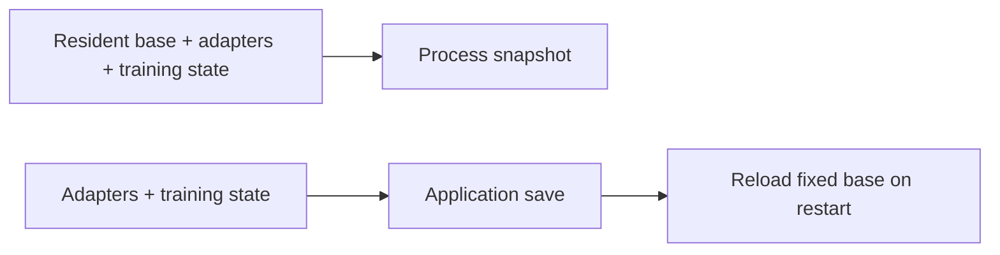

# Single-GPU fine-tuning snapshots

**LoRA makes training state small, but a process snapshot still includes the
resident base model.** That is the main tradeoff this experiment measures. Exact LoRA
continuation passed on EC2 with qualified compatibility; the
[results](../experiments/results.md) own measurements, the
[implementation contract](../docs/implementation-plan.md) owns acceptance criteria,
and the [runbook](../experiments/finetuning/README.md) owns commands.

This survey covers supervised fine-tuning—learning from examples with desired
outputs—on one NVIDIA GPU. Research/product sources were checked September 13,
2026; feasibility sources September 14. Product claims below are dated vendor
documentation, not independently tested support or current availability.

## 1. What changes from the mechanism probes

Training adds optimizer history, learning-rate schedule, data position, and random
state to the tensor probes. Adam's history influences the next weight update;
restoring weights alone can therefore change training. Application checkpoints
explicitly save this state; process snapshots also preserve execution machinery.
[NVIDIA mechanism](https://github.com/NVIDIA/cuda-checkpoint),
[CRIU integration](https://www.criu.org/GPU_Checkpointing),
[Accelerate state saving](https://huggingface.co/docs/accelerate/usage_guides/checkpoint).

One GPU can still involve multiple processes through data loading, compilation,
or tracking. Our baseline uses pre-tokenized local data and no worker processes.
[PyTorch data loading](https://docs.pytorch.org/docs/stable/data.html).

### Choose a complete update as the pause point

```text
forward/backward → optimizer + schedule → clear gradients
 → record completed count and next example → synchronize CUDA → ready and wait
```

This cooperative boundary avoids partial gradients and makes restored state
inspectable. It does not establish arbitrary-point suspension. Synchronization
finishes queued GPU work; it does not empty PyTorch's reusable allocation cache.
Measure both allocated and reserved VRAM.
[CUDA memory management](https://docs.pytorch.org/docs/2.11/notes/cuda.html#memory-management).

## 2. Full fine-tuning, LoRA, and QLoRA

| Method | What changes | Consequence for checkpointing |
| --- | --- | --- |
| Full fine-tuning | Base-model weights | Application saves include the large model and optimizer state. |
| LoRA | Small adapter matrices; base stays frozen | Application saves can reference the fixed base; process images retain its resident state. |
| QLoRA | Adapters over a quantized frozen base | Smaller base allocations, plus quantization metadata and optimizer compatibility checks. |

LoRA reduces trainable state, not the need to run the base model. QLoRA's low-bit
weights and paged optimizer are separate choices.
[LoRA paper](https://arxiv.org/abs/2106.09685),
[QLoRA paper](https://arxiv.org/abs/2305.14314).
An adapter export omits optimizer, schedule, data position, and RNG; it is not a
complete training-resume checkpoint.
[PEFT format](https://huggingface.co/docs/peft/developer_guides/checkpoint).

### The central tradeoff for LoRA



For illustration, 7 billion parameters at two bytes each occupy 14 GB; four-bit
weights occupy 3.5 GB before metadata and higher-precision components. These are
arithmetic sizes, not measured memory or fit guarantees. A generic snapshot tool
cannot infer that an allocation can be omitted just because `requires_grad=False`.
LoRA therefore favors compact application saves; process restoration may still
save expensive reconstruction. Full fine-tuning narrows this size difference.

## 3. Compatibility issues that matter first

### EC2 route and its qualification

The tested EC2 A10G route uses CRIU's CUDA plugin as the sole owner of GPU
lock/checkpoint/restore/unlock. Same-host CPU, tensor, and isolated LoRA restoration
passed. Interrupted-system-call warnings and unresolved sharing ownership remain
qualified; preserved mapping addresses/flags do not prove driver-side sharing.
[Environment and evidence](../experiments/results.md#four-update-lora-acceptance-and-timing--2026-09-14),
[plugin restore hook](https://github.com/checkpoint-restore/criu/blob/criu-dev/plugins/cuda/cuda_plugin.c#L493-L505).

### Historical DMTCP route on the L4 container

DMTCP's native CUDA plugin requires launching the application through DMTCP. It
is distinct from historical CRAC. The pinned maintenance revision restored a
complete tensor process after original exit, but emitted four shared-memory
warnings; no DMTCP LoRA or EC2 timing comparison was performed.
[Release](https://github.com/dmtcp/dmtcp/releases/tag/v4.2.0),
[pinned plugin](https://github.com/dmtcp/dmtcp/tree/b175bb5ccadd2f02d11cf052f586d2d9ac62ad53/plugin/cuda).

DMTCP stores `/dev/zero (deleted)` contents as private memory, potentially losing
sharing. Separately, a kernel-backed mapping such as `io_uring` needs its kernel
object, not just bytes; an unsupported required object blocks that workload.
[Pinned serialization](https://github.com/dmtcp/dmtcp/blob/b175bb5ccadd2f02d11cf052f586d2d9ac62ad53/src/writeckpt.cpp#L479-L494),
[mapping diagnostics](https://github.com/dmtcp/dmtcp/blob/b175bb5ccadd2f02d11cf052f586d2d9ac62ad53/src/plugin/ipc/file/fileconnlist.cpp#L451-L463).
The CUDA runtime/header mismatch and tested revisions remain in the
[historical results](../experiments/results.md).

### Paged optimizers are the most concrete QLoRA trap

In bitsandbytes 0.49.2, sufficiently large paged optimizer buffers use
`cudaMallocManaged`: memory managed across CPU and GPU, also called unified memory
or UVM. The tested NVIDIA checkpoint revision excludes UVM. Inspect after Adam
state is initialized; managed allocations can exist before visible paging, and
small buffers may use the ordinary path.
[Optimizer explanation](https://huggingface.co/docs/bitsandbytes/explanations/optimizers),
[buffer selection](https://github.com/bitsandbytes-foundation/bitsandbytes/blob/0.49.2/bitsandbytes/optim/optimizer.py#L329-L337),
[allocator](https://github.com/bitsandbytes-foundation/bitsandbytes/blob/0.49.2/csrc/pythonInterface.cpp#L604-L610),
[pinned NVIDIA limits](https://github.com/NVIDIA/cuda-checkpoint/blob/00d5cce84c628088d6caa203fc4af40c1538b6f7/README.md).

Start with ordinary AdamW; test four-bit weights with a non-paged optimizer
separately. Ordinary LoRA success does not prove bitsandbytes compatibility, and a
paged-optimizer failure does not exclude every QLoRA configuration.

### Other boundaries

Allow host RAM for staged GPU state as well as the CPU process. Keep CPU progress
behind a release gate; CUDA suspension alone does not freeze Python. Start eager,
without external services, because memory restore cannot undo external writes.
These are experiment restrictions, not universal unsupported-feature claims.
The pinned NVIDIA source lists exact IPC/driver limits; changing CPU capture tools
does not add driver capabilities.

“Gradient checkpointing” instead discards intermediate activations and recomputes
them during backward execution. It does not create a restartable process image.
[PyTorch activation checkpointing](https://docs.pytorch.org/docs/stable/checkpoint.html).

## 4. Papers most relevant to this project

The following measurements are author-reported for their stated environments;
none validates our exact LoRA/QLoRA configuration.

### CRIUgpu — closest to our implementation path

Stoyanov et al., February 2025: integrate vendor GPU capture with CRIU. The
single-H100 Llama 3.1 8B experiment reports **77.40 s capture, 38.83 s restore,
55.89 GB image**, with an older driver and HDD storage. Tables 2/4 distinguish
GPU-to-RAM staging from full snapshot I/O. These are not predictions for our A10G.
[Paper](https://arxiv.org/html/2502.16631v1),
[upstream plugin](https://github.com/checkpoint-restore/criu/tree/criu-dev/plugins/cuda).

### CRIU-LZ4 — direct fine-tuning evidence, with a useful negative result

Stoyanov et al., EuroMLSys 2026, §5.3: B200 training images shrink **1.1–1.6×**,
but freeze time grows **2–3×** and restore **1.5–1.7×**. Training state compresses
less than empty inference caches; measure compression rather than assume a gain.
The exact adapter/quantization recipe is insufficiently specified. Check compression
support in the installed build.
[Paper/Figure 9](https://radostin.io/files/stoyanov-euromlsys-2026.pdf),
[CRIU options](https://github.com/checkpoint-restore/criu/blob/criu-dev/Documentation/criu.txt).

### GCR — the most useful performance paper to read next

Zeng et al., FAST 2026: separate driver control state from data copying and track
modified memory to skip unchanged buffers. They report **72.1% lower checkpoint
latency** against their NVIDIA baseline; **86.6% size reduction is an inference
result**. Checkpoints remain in CPU memory, so these are not durable disk timings.
The public artifact uses two A100s and specific frameworks.
[Paper §§5/6](https://www.usenix.org/system/files/fast26-zeng.pdf),
[artifact recognition](https://www.usenix.org/conference/fast26/presentation/zeng),
[source](https://github.com/thustorage/GCR).

### PhoenixOS — copying while execution continues

Wei et al., SOSP 2025: overlap checkpoint/restore with execution using validated
inferences about memory operations. Public Apache-2.0 code supports single-GPU
capture, with substantial build machinery and ongoing development. Relevant if
copying becomes the measured bottleneck; not a small drop-in optimization.
[Paper](https://arxiv.org/html/2405.12079v4),
[source/support notes](https://github.com/SJTU-IPADS/PhoenixOS).

### Singularity — why a cloud provider builds this

Shukla et al., Microsoft, 2022: a device-proxy architecture supports training
preemption, migration, and resizing for fleet scheduling. This is systems precedent,
not evidence of a currently purchasable snapshot library.
[Publication](https://www.microsoft.com/en-us/research/publication/singularity-planet-scale-preemptive-and-elastic-scheduling-of-ai-workloads/),
[paper](https://arxiv.org/abs/2202.07848).

### CRAC — evidence that driver limitations are not universal laws

Jain and Cooperman, SC 2020: a different DMTCP architecture supports CUDA streams
and unified memory. Its early repository warns of incomplete portability work;
it is historical context, not an easy fix for today's UVM restriction.
[Paper](https://arxiv.org/abs/2008.10596),
[source caveats](https://github.com/DMTCP-CRAC/CRAC-early-development).

## 5. Open-source tools and frameworks

Process tools capture execution; training frameworks explicitly rebuild it.
A `resume` option alone does not preserve a CUDA process.

| Tool | Relevant role |
| --- | --- |
| CRIU + NVIDIA helper | Implemented process route; constraints in §3 |
| DMTCP CUDA plugin | Historical alternative requiring DMTCP launch |
| [Transformers + PEFT](https://huggingface.co/docs/peft/developer_guides/checkpoint) | Current explicit training loop and adapters |
| [TRL SFTTrainer](https://huggingface.co/docs/trl/sft_trainer) | Future common-framework comparison |
| [Accelerate](https://huggingface.co/docs/accelerate/usage_guides/checkpoint) | Application-state save/load; custom-state registration |
| [torchtune 0.6](https://meta-pytorch.org/torchtune/stable/deep_dives/checkpointer.html) | Model/recipe-state checkpoints; cited guide uses epoch-end saves |
| GCR / PhoenixOS | Research optimization paths, discussed above |
| [Cedana daemon](https://github.com/cedana/cedana) | AGPL-3.0 orchestration; its separate proprietary GPU plugin is not open source |

Use complete framework training checkpoints: Transformers `save_only_model=True`
omits resume state. Pin revisions before reproduction; development links move.
[Trainer arguments](https://huggingface.co/docs/transformers/main/en/main_classes/trainer),
[PEFT serialization](https://github.com/huggingface/peft/blob/main/src/peft/utils/save_and_load.py),
[TRL source](https://github.com/huggingface/trl/blob/main/trl/trainer/sft_trainer.py).

## 6. Companies already doing related work

These dated vendor claims establish related offerings, not our workload's
correctness or production adoption.

| Offering | Documented scope and limit |
| --- | --- |
| [MemVerge](https://docs.memverge.com/AI/GPU_Cluster_Manager/0.4.0/quickstart_guide/checkpoint-restore/) | Training workspace pause/resume; quickstart leaves training code as a placeholder. [Batch requirements](https://docs.memverge.com/MMBatch/latest/User%20Guide/Getting%20Started/prerequisites/) specify single-GPU, same-model restore/full GPU backups. |
| [Cedana](https://docs.cedana.ai/daemon/checkpoint-restore/cr-1) | GPU save/migrate/resume and a [vendor L4 training benchmark](https://docs.cedana.ai/articles/performance-of-cedanas-gpu-interception). Proprietary GPU option requires access; cited compatibility table stops at driver 570. |
| [Modal](https://modal.com/docs/guide/memory-snapshots) | GPU snapshots were alpha, capturing initialized state before function execution. Not an arbitrary mid-training API; weight-loading-bound startup may not improve. |
| [Google GKE](https://docs.cloud.google.com/kubernetes-engine/docs/concepts/pod-snapshots) | September 9, 2026 docs: single-GPU initialization snapshots using NVIDIA/gVisor, specified L4/A100/H100 types, matching hardware/software; external connections change. |
| [NVIDIA Dynamo](https://docs.nvidia.com/dynamo/v1.0.2/kubernetes-deployment/deployment-guide/snapshot) | CRIU/NVIDIA snapshots for initialized inference workers; snapshot-agent marked [preview](https://docs.dynamo.nvidia.com/dynamo/dev/reference/release-artifacts) when checked. |
| [Beam](https://docs.beam.cloud/v2/topics/cold-start) | `checkpoint_enabled=True` captures after `on_start`, including GPU initialization. |
| [Cerebrium](https://cerebrium.ai/blog/reducing-gpu-cold-starts-with-memory-snapshots-restoring-cuda-workloads-in-second) | July 1, 2026 engineering article: warmed-container CPU/GPU snapshots for serving. |
| Microsoft Singularity | Training preemption/migration research service; see §4. |

[Run:ai](https://run-ai-docs.nvidia.com/self-hosted/workloads-in-nvidia-run-ai/using-training/checkpointing-preemptible-workloads)
also documents preemptible training with application checkpoints—the baseline
transparent snapshots must compete with.

### Why startup snapshots can be an easier product

An initialized inference image can start many workers, amortizing one capture.
Training checkpoints contain new progress and must be saved repeatedly; many are
never restored. Startup also offers a controlled boundary. Exact training resume
must preserve data position and optimizer history, which cannot simply be dropped.

## 7. Implemented bounded fine-tuning experiment

### Validated configuration

Qwen2.5-0.5B, FP32 rank-8 LoRA, non-paged AdamW, batch 1, at most 128 tokens,
four updates, capture after two. A repeated trial also captures after three.
[Full workload contract](../docs/implementation-plan.md#1-chosen-workload).

### Three runs answer three different questions

Two uninterrupted references establish repeatability. Application restart saves
explicit training state and rebuilds the trainer. CRIU restores the process image
after verified original exit. All use the same loop and cached base assets;
application saves cannot feed the CRIU route.

### What counts as success

Exact named state before the next update, then matching losses and updates.
Include frozen-base identity, Adam, schedule, cursor, RNG, modes, and adapters.
For dropout 0.1, prove actual CUDA dropout execution and generator advancement;
inspect restored behavior before changing it. Verify post-exit GPU availability
with an independent job B. [Acceptance gates](../docs/implementation-plan.md#4-experiment-sequence-and-gates).

### What the repository has established

Ordinary LoRA continuation, application restart, active dropout, and repeated
CRIU restoration passed on EC2 A10G/driver 570.172.08. Sharing qualifications
remain. See [dated results](../experiments/results.md#four-update-lora-acceptance-and-timing--2026-09-14)
for image sizes, timings, and memory; earlier L4 results are separate evidence.

### Add one source of complexity at a time

Possible follow-ups: BF16, then four-bit weights with a non-paged optimizer;
TRL; larger/full fine-tuning; compression or incremental capture. Each needs its
own compatibility and continuation checks. These are options, not delivery estimates.

## 8. Measure the return, not just the snapshot

Use equal completion/storage criteria for both routes. Separate image completion,
original exit, post-exit GPU availability, filesystem sync, and the next update;
include clock-offset correction and repeat timings under stated cache conditions.
The [measurement contract](../docs/implementation-plan.md#task-6-measure-and-report)
specifies details. An in-RAM image solves a different failure case from independent
storage; a hash alone does not establish persistence.

```text
Process cost     = save + restore-to-next-update + work repeated
Application cost = save + rebuild-to-next-update + work repeated
```

At the same cooperative boundary, neither repeats completed work. After unexpected
failure, only an already-saved checkpoint helps. Periodic-save overhead also
matters; with uniformly distributed failures, expected lost work is approximately
half the save interval. That is an assumption, not a measured customer outcome.

Prefer application saves when small state, portable artifacts, and tolerable
startup suffice. Process snapshots are useful when avoided reconstruction or
preserved execution state justifies larger transfers and tighter compatibility.
The measured LoRA snapshot restored faster but captured much more data; this is
not a general speed advantage or a host-loss recovery result.

## 9. Remaining uncertainties

Open questions: sharing ownership, replacement-host compatibility, storage survival,
real warning-triggered recovery, other precision/quantization modes, and inference
startup. NVIDIA's 595.91.07 release notes include a restore-related device-information
fix; migration must be tested independently of same-host success.
[API requirements](https://docs.nvidia.com/cuda/cuda-driver-api/group__CUDA__CHECKPOINT.html),
[release notes](https://docs.nvidia.com/datacenter/tesla/tesla-release-notes-595-91-07/index.html#fixed-issues).

Skipping unchanged base weights is a possible optimization, but must preserve
addresses and resource relationships; ignoring tensors marked frozen is insufficient.
The [independent lifecycle plan](../docs/independent-lifecycle-plan.md) is proposed,
not yet implemented AWS recovery.

## Sources and reading order

<a id="start-with-these-papers"></a>
<a id="implementation-references"></a>
<a id="product-evidence"></a>

Primary links sit beside their claims. Read CRIUgpu for the architecture, GCR for
incremental copying, and CRIU-LZ4 before assuming compression helps; then PhoenixOS
for concurrency. Sections 3/5 cover implementation sources and §6 dated products.
Pin versions before reproducing work; author-reported performance is not a local
benchmark.
